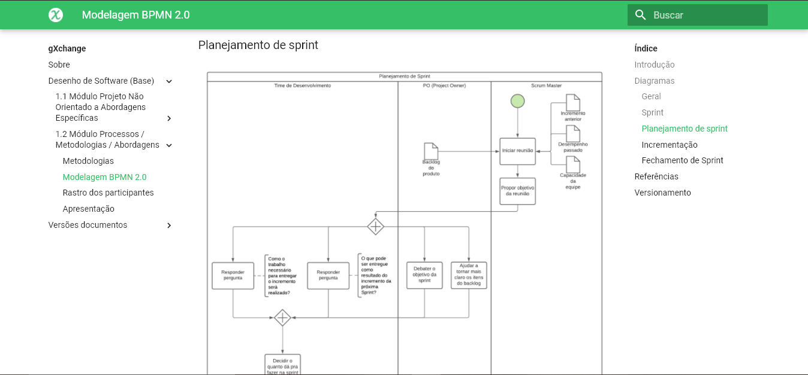
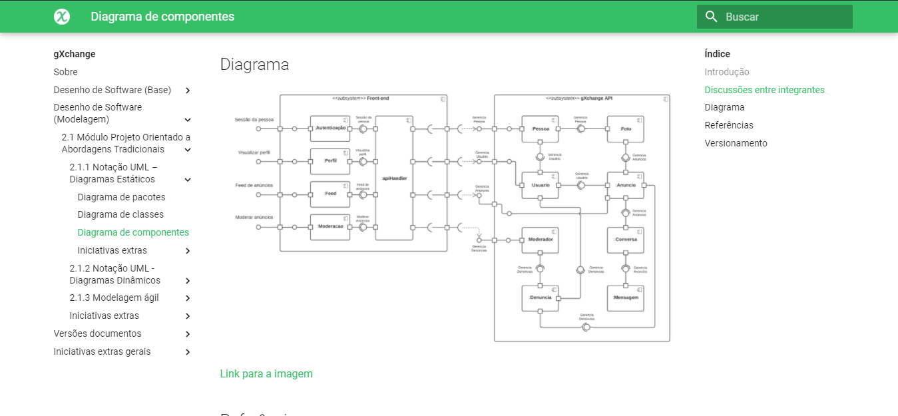
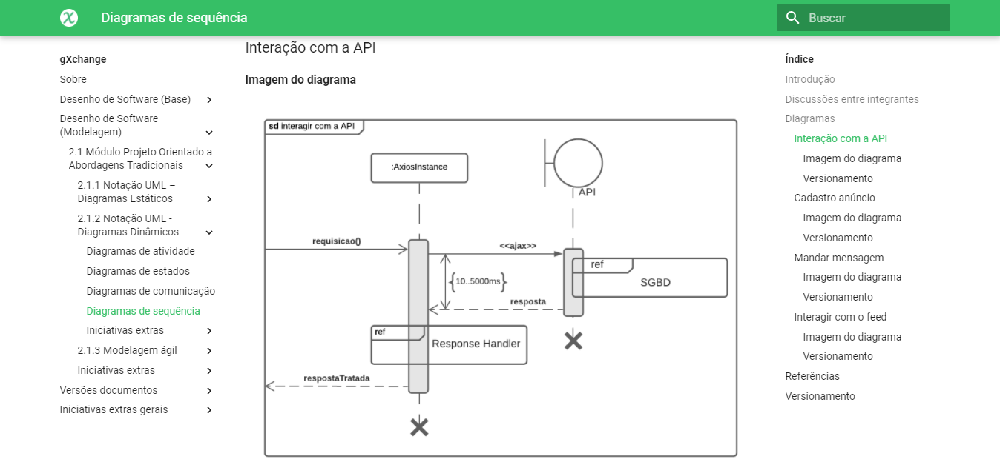
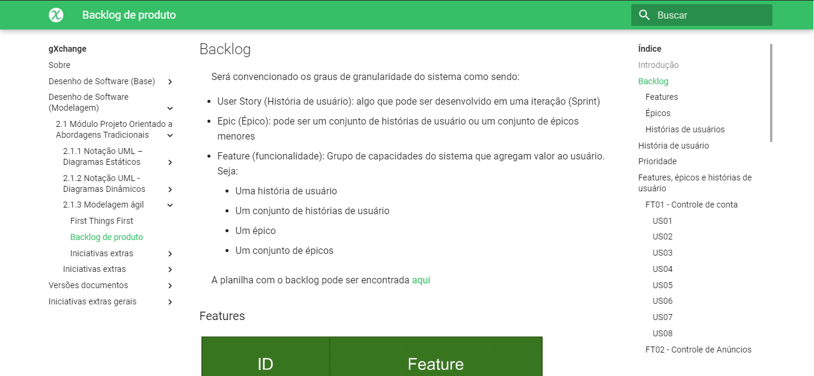
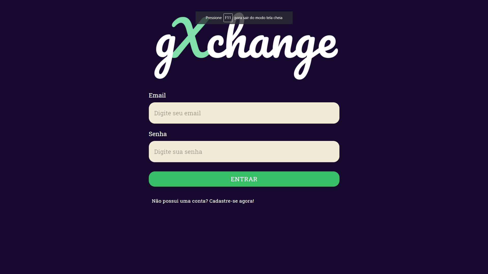
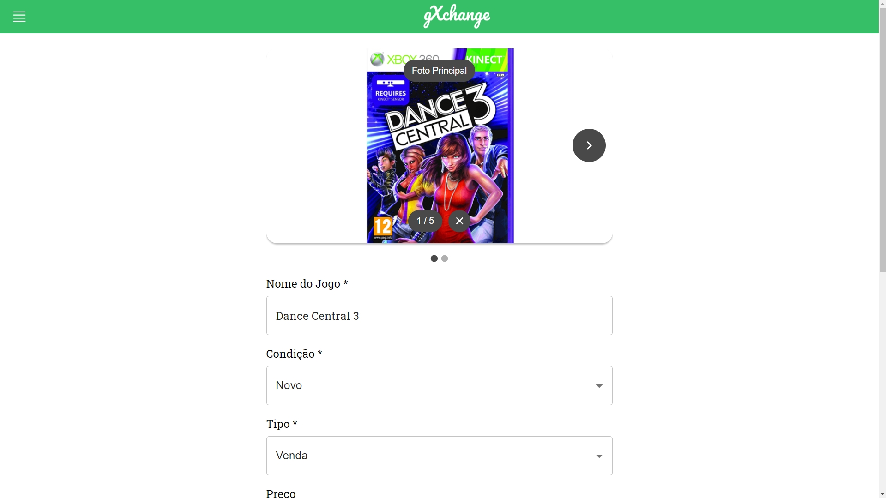

# gXchange

**Código da Disciplina**: FGA0208 
**Número do Grupo**: 07 

## Alunos

| Matrícula | Aluno |
| -- | -- |
| 18/0018728  |  Igor Batista Paiva |
| 18/0054082  |  Marcelo Victor de Sousa Silva |
| 18/0054848  |  Rhuan Carlos Pereira de Queiroz |
| 18/0028260  |  Thiago Aparecido Lopes Santos |
| 18/0028308  |  Thiago Guilherme Muniz Ferreira |
| 18/0029223  |  Washington Bispo Arishita Junior |

## Sobre
Este repositório é destinado ao grupo 7 - [**gXchange**](https://github.com/UnBArqDsw2020-2/2020.2_G7_gXchange_DOCS), contém toda a documentação do projeto da disciplina de Arquitetura e Desenho de Software, ministrada pela professora Milene Serrano, na Universidade de Brasília - Gama, durante o período de 2020/2.

## Screenshots Primeira Entrega <<FOCO: DSW(Base)>>

## Vídeo(s) Primeira Entrega <<FOCO: DSW(Base)>>

### Desenho de Software (Base):

#### 1.1 - [Módulo Projeto Não Orientado a Abordagens Específicas](https://youtu.be/Jo4Rm84yUq0)

#### 1.2 - [Módulo Processos / Metodologias / Abordagens](https://youtu.be/48xTzKhKb_Y)

## Screenshots Segunda Entrega <<FOCO: DSW(Modelagem)>>

## Vídeo(s) Segunda Entrega <<FOCO: DSW(Modelagem)>>

### Desenho de Software (modelagem):

#### 2.1 Módulo Projeto Orientado a Abordagens Tradicionais

##### 2.1.1 - [Notação UML – Diagramas Estáticos](https://youtu.be/zOOK5ZxOAwA)

##### 2.1.2 - [Notação UML – Diagramas Dinâmicos](https://youtu.be/_iZWiHMbcMY)

##### 2.1.3 - [Modelagem ágil](https://youtu.be/JOU-X-XP3X0)

## Screenshots Terceira Entrega <<FOCO: DSW(Padrões de Projeto)>>

## Vídeo(s) Terceira Entrega <<FOCO: DSW(Padrões de Projeto)>>

##### 3.1 - [Padrões de Projeto - GRASPs](https://youtu.be/qQglFV-Mie0)

##### 3.2 - [Padrões de Projeto - GoFs](https://youtu.be/4m0vWAqYDn8)

##### 3.3 - [Padrões de Projeto - Emergentes](https://youtu.be/ALiAMjn1VUM)

## Screenshots Quarta Entrega (FINAL) <<FOCOS: Arquitetura & Reutilização de Software & PROJETO FINAL>>

## Vídeo(s) Quarta Entrega (FINAL) <<FOCOS: Arquitetura & Reutilização de Software & PROJETO FINAL>>
Aqui serão adicionados o(s) vídeo(s) da Entrega Final.

##### 4.1 - [Arquitetura de Software - Estilos e Padrões Arquiteturais](https://youtu.be/1OSHgcInQr8)

##### 4.2 - [Arquitetura de Software - Reutilização de Software](https://youtu.be/ZU9jdlWs-lk)

## Descritivo dos Principais Aspectos Técnicos

**Principal(is) Metodologia(s) Adotada(s)**: Scrum e XP 
**Principais Linguagens Utilizadas e/ou Pretendidas**: Python e Typescript 
**Principais Tecnologias Utilizadas e/ou Pretendidas**: Django e React 
**Principal(is) Estilo(s) Arquitetural(is) Adotado(s)**: 

## O Projeto está rodando?

(X) SIM (gxchange.netlify.app)
( ) NÃO

## Informações Complementares 

No momento não há informações complementares.
