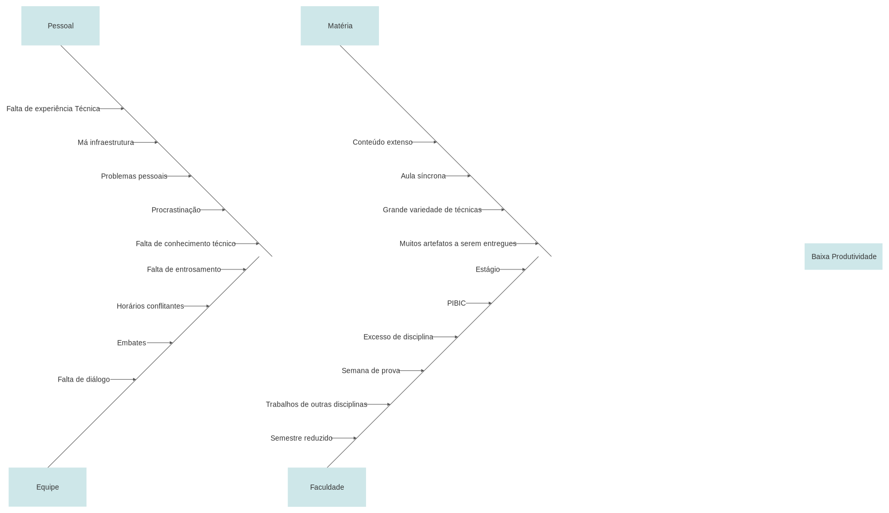
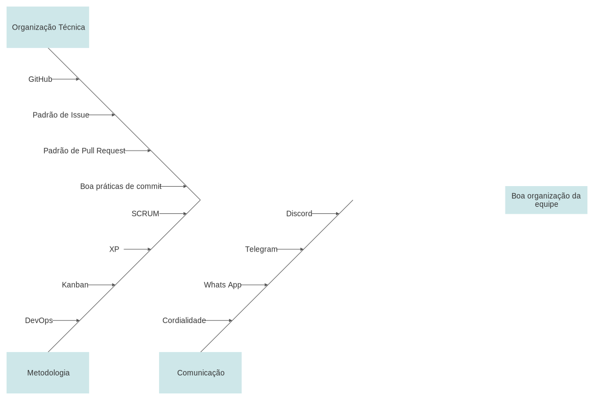

# Diagramas de causa-efeito

## Baixa produtividade

<a href="https://drive.google.com/file/d/1uOEwphsWvs2tr0afgLUH2MGsImJ_z7rM/view?usp=sharing" target="_blank" rel="noopener">Link para a imagem</a>

## Organização da equipe

<a href="https://drive.google.com/file/d/1JtSmI_9RORgz0XIO4KZ8njj4PsrgOuHg/view?usp=sharing" target="_blank" rel="noopener">Link para a imagem</a>

## Referências

>ISHIKAWA, Kaoru. "Introduction to quality control". Productivity Press, 1990.

>"Smartdraw". Smartdraw. Disponível em: https://www.smartdraw.com/. Acesso em: 15 fev. 2021.

## Versionamento

| Versão | Data       | Modificação                    | Motivo | Autor         |
| ------ | ---------- | -------------------------------| ------ | ------------- |
| 1.0 | 15/02/2021 | Criação do documento | Analisar os riscos do projeto envolvendo a equipe | Todos os integrantes |
