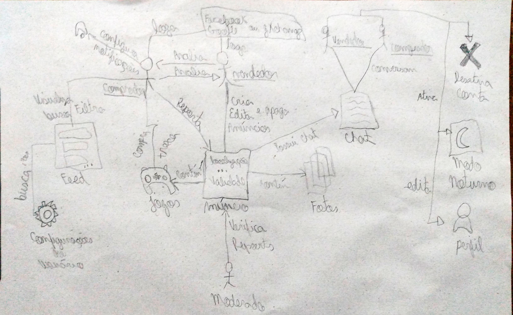
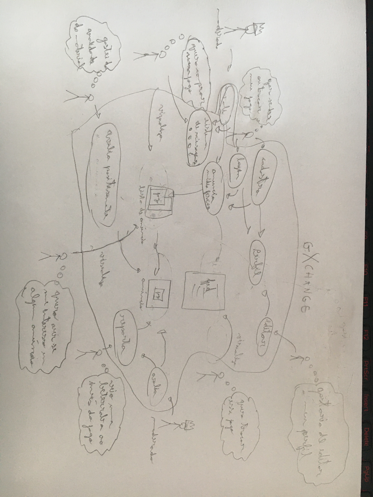
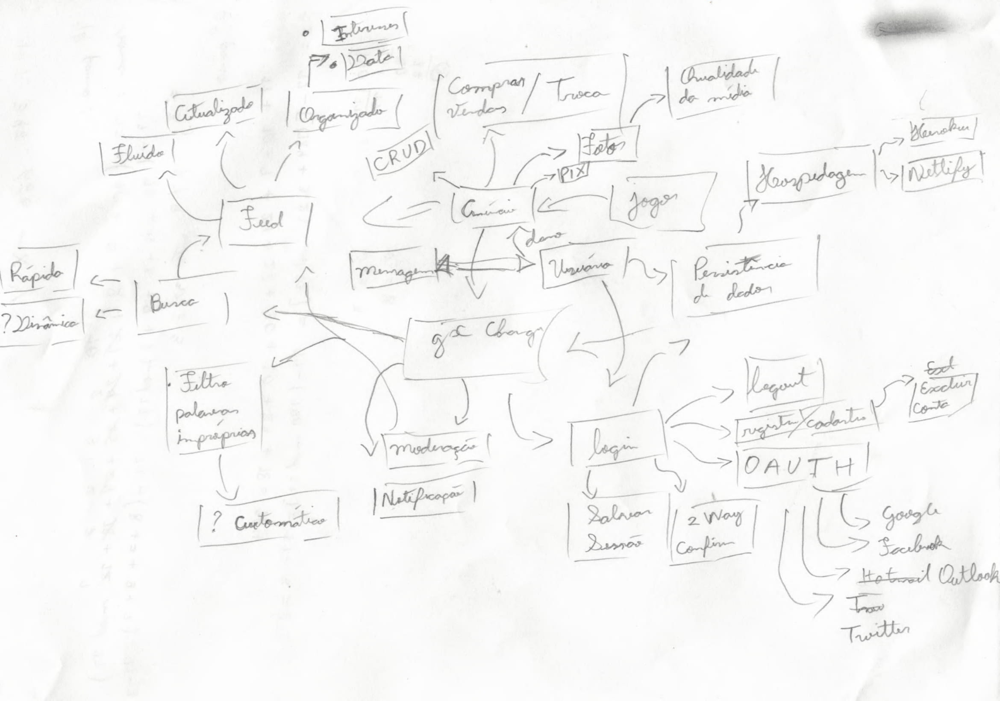
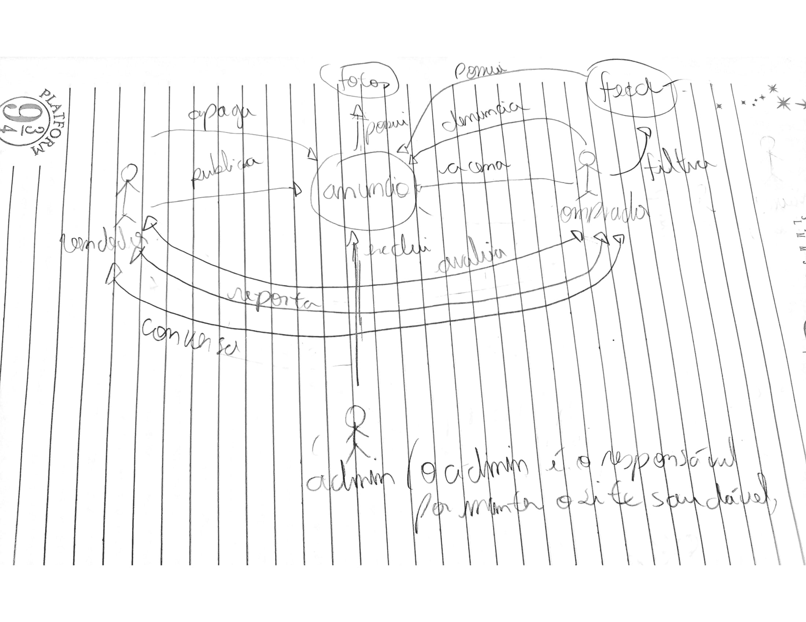
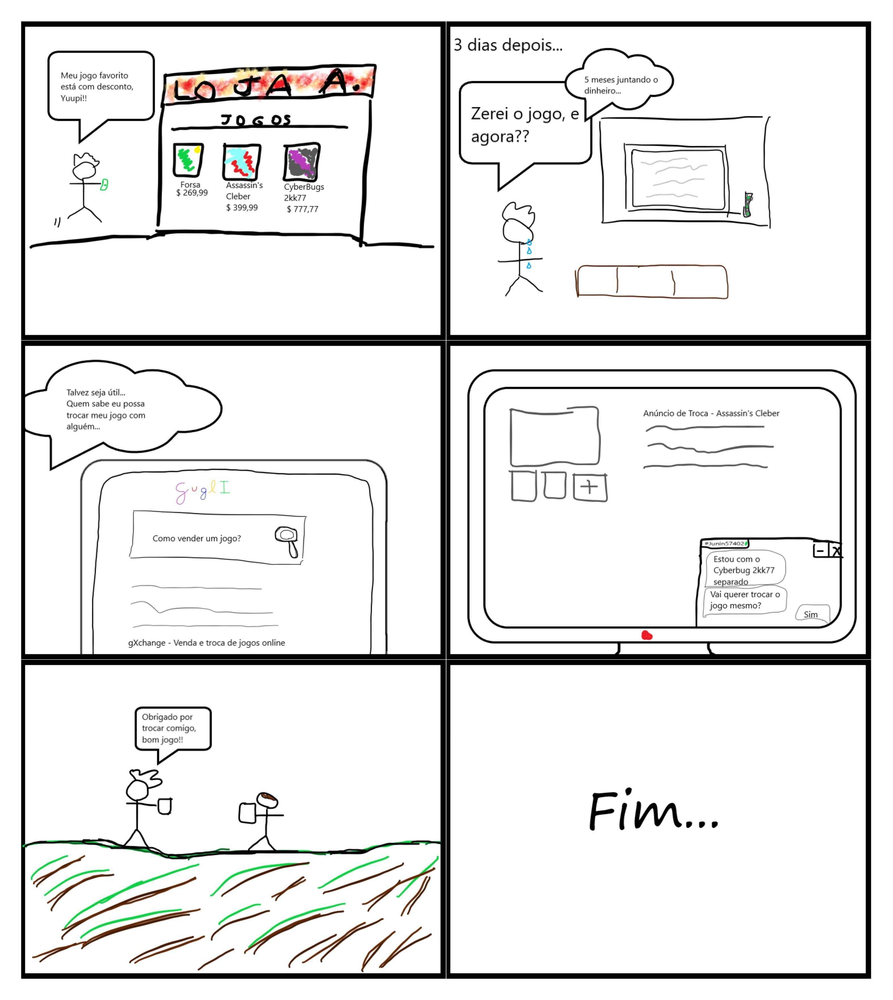

# Design Sprint

## Introdução

A design sprint é um processo de 5 dias para responder questões críticas de negócio através de design, prototipação, e teste de ideias com clientes. Porém no nosso projeto a design sprint foi adaptada para que fosse possível a realização nos prazos do projeto.

## Processo

O tempo utilizado para cada etapa foi:

- Unpack: 30 min
- Sketch: 30 min
- Decision: 45 min
- Prototype: 14 horas
- Testing: 30 min

### 1º Unpack

Foi realizado uma sessão de brainstorming, em que cada integrande escreveu em um postsheet uma possível funcionalidade do gXchange.

<a href="https://drive.google.com/file/d/1H8sKywsvaYAmn7sOsN99mRqZH5Q6O0MI/view?usp=sharing" target="_blank" rel="noopener">Link para a imagem</a>

### 2º Sketch

A etapa de sketch foi realizado da seguinte forma: cada integrante do grupo desenvolveu um rich picture, utilizando as ideias que foram concebidas na fase anterior.

#### Igor

<a href="https://drive.google.com/file/d/1DX4rVJuT8bC3aMbufkYyxH36cGaoCVEu/view?usp=sharing" target="_blank" rel="noopener">Link para a imagem</a>

#### Marcelo

<a href="https://drive.google.com/file/d/11EPNhKOdXngcmWQQZXIYBMfmg3bgcULl/view?usp=sharing" target="_blank" rel="noopener">Link para a imagem</a>

#### Rhuan

<a href="https://drive.google.com/file/d/1ZVlHOMIaXA0zkhOkmaJCKhaNYOuoDLR1/view?usp=sharing" target="_blank" rel="noopener">Link para a imagem</a>

#### Thiago Lopes

<a href="https://drive.google.com/file/d/1mSPK40aGVul1n5fWzii9dBM-owVpJVFH/view?usp=sharing" target="_blank" rel="noopener">Link para a imagem</a>

#### Washington

<a href="https://drive.google.com/file/d/1GLOnkgMb5Vzzou3cRRSDZHvW6_KOy0X-/view?usp=sharing" target="_blank" rel="noopener">Link para a imagem</a>

### 3º Decision

Após a etapa de sketch, comparamos os rich pictures de cada integrante, e decidimos que o rich picture do Igor seria o escolhido.

<a href="https://drive.google.com/file/d/1H8sKywsvaYAmn7sOsN99mRqZH5Q6O0MI/view?usp=sharing" target="_blank" rel="noopener">Link para a imagem</a>

### 4º Prototype

A partir dos processos anteriores da design sprint, foi desenvolvido um protótipo de média fidelidade. A partir disso, teve uma evolução para um protótipo de alta fidelidade.

#### Protótipo de média fidelidade

As imagens do protótipo podem ser acessadas [aqui](/desenho/base/1.1/design_sprint/prototipo_media/)

<iframe style="border: 1px solid rgba(0, 0, 0, 0.1);" width="800" height="450" src="https://www.figma.com/embed?embed_host=share&url=https%3A%2F%2Fwww.figma.com%2Fproto%2FkB1mXdqJKSqapMchhTGEKd%2FProt%25C3%25B3tipo-de-M%25C3%25A9dia-gXchange%3Fscaling%3Dscale-down%26node-id%3D2%253A9" allowfullscreen></iframe>

#### Protótipo de alta fidelidade

As imagens do protótipo podem ser acessadas [aqui](/desenho/base/1.1/design_sprint/prototipo_alta/)

<iframe style="border: 1px solid rgba(0, 0, 0, 0.1);" width="800" height="450" src="https://www.figma.com/embed?embed_host=share&url=https%3A%2F%2Fwww.figma.com%2Fproto%2FHHDDXocoxIRDL002Ic7uYZ%2FProt%25C3%25B3tipo-de-Alta-gXchange%3Fnode-id%3D2%253A9%26scaling%3Dscale-down" allowfullscreen></iframe>

### 5º Testing

Para avaliar o protótipo de alta fidelidade escolhemos o método de inspeção de avaliação heurística.

#### Problema 1

<table style="font-size: 15px">
<thead>
  <tr>
    <th colspan="2">2. Compatibilidade do sistema com o mundo real 
      4. Consistência e padrões
    </th>
  </tr>
</thead>
<tbody>
  <tr>
    <td style="border-right: 0.5px solid #e8e8e8">Verificação:    
 O sistema é compatível com a lógica do usuário? O sistema mantém o padrão entre as telas?

    </td>
    <td>Grau de Severidade:   (&nbsp;&nbsp;) 0 - Sem importância   (&nbsp;&nbsp;) 1 - Cosmético   (&nbsp;&nbsp;) 2 - Simples   (X) 3 - Grave    (&nbsp;&nbsp;) 4 - Catastrófico  
    </td>
  </tr>
  <tr>
    <td colspan="2">
        <b>Natureza do Problema:</b>&emsp; (&nbsp;&nbsp;) Barreira&emsp; (X) Obstáculo &emsp;  (&nbsp;&nbsp;) Ruído
    </td>
  </tr>
  <tr>
    <td colspan="2">
        <b>Perspectiva de usuário:</b>&emsp; (&nbsp;&nbsp;) Problema Geral&emsp;  (X) Problema Preliminar&emsp;  (&nbsp;&nbsp;) Problema Especial
    </td>
  </tr>
  <tr>
    <td colspan="2">
        <b>Perspectiva da tarefa:</b>&emsp; (&nbsp;&nbsp;) Problema Principal&emsp;  (X)  Problema Secundário
    </td>
  </tr>
  <tr>
    <td colspan="2">
        <b>Perspectiva do projeto:</b>&emsp; (&nbsp;&nbsp;) Problema Falso&emsp;  (&nbsp;&nbsp;)  Problema Novo&emsp;  (X) Não se aplica
    </td>
  </tr>
  <tr>
    <td  colspan="2">
      <b>Descrição do Problema:</b>     <u>Contexto:</u> O usuário ao tentar voltar de uma página  <u>Causa:</u> A tela do anúncio e das mensagens  <u>Efeito sobre o usuário:</u> Leve incômodo   <u>Efeito sobre a tarefa:</u> Leve atraso   <u>Correção possível:</u> Inserir o botão de voltar nas telas
    </td>
  </tr>
</tbody>
</table>

#### Problema 2

<table style="font-size: 15px">
<thead>
  <tr>
    <th colspan="2">2. Compatibilidade do sistema com o mundo real 
      3. Controle do usuário e liberdade:
    </th>
  </tr>
</thead>
<tbody>
  <tr>
    <td style="border-right: 0.5px solid #e8e8e8">Verificação:    
 O sistema é compatível com a lógica do usuário?   O sistema tem disponível funções que possibilitem saídas de funções desejadas?

    </td>
    <td>Grau de Severidade:   (&nbsp;&nbsp;) 0 - Sem importância   (&nbsp;&nbsp;) 1 - Cosmético   (X) 2 - Simples   (&nbsp;&nbsp;) 3 - Grave    (&nbsp;&nbsp;) 4 - Catastrófico  
    </td>
  </tr>
  <tr>
    <td colspan="2">
        <b>Natureza do Problema:</b>&emsp; (&nbsp;&nbsp;) Barreira&emsp; (&nbsp;&nbsp;) Obstáculo &emsp;  (X) Ruído
    </td>
  </tr>
  <tr>
    <td colspan="2">
        <b>Perspectiva de usuário:</b>&emsp; (X) Problema Geral&emsp;  (&nbsp;&nbsp;) Problema Preliminar&emsp;  (&nbsp;&nbsp;) Problema Especial
    </td>
  </tr>
  <tr>
    <td colspan="2">
        <b>Perspectiva da tarefa:</b>&emsp; (&nbsp;&nbsp;) Problema Principal&emsp;  (X)  Problema Secundário
    </td>
  </tr>
  <tr>
    <td colspan="2">
        <b>Perspectiva do projeto:</b>&emsp; (&nbsp;&nbsp;) Problema Falso&emsp;  (&nbsp;&nbsp;)  Problema Novo&emsp;  (X) Não se aplica
    </td>
  </tr>
  <tr>
    <td  colspan="2">
      <b>Descrição do Problema:</b>     <u>Contexto:</u> O usuário ao tentar voltar para o topo do feed de anúncios  <u>Causa:</u> A quantidade itens dispostos na tela  <u>Efeito sobre o usuário:</u> Leve incômodo   <u>Efeito sobre a tarefa:</u> Atraso   <u>Correção possível:</u> Inserir o botão de voltar para o topo
    </td>
  </tr>
</tbody>
</table>

## Referências

>Lucidspark. Disponível em: https://lucidspark.com/pt. Acesso em: 19 fev. 2021

>"The Design Sprint". Google Ventures. Disponível em: https://www.gv.com/sprint/. Acesso em: 16 fev. 2021.

>MACIEL, Cristiano; Nogueira, José; NEUMANN Leandro; GARCIA, Ana. "Avaliação Heurística de Sítios na Web". Instituto de Computação - Universidade Federal Fluminense (UFF).

>BARBOSA, Simone; SILVA, Bruno. "Interação Humano-Computador". Elsevier Editora Ltda, 2010.

## Versionamento

| Versão | Data       | Modificação               | Motivo | Autor         |
| ------ | ---------- | ------------------------- | ------ | ------------- |
|  1.0   | 16/02/2021 | Criação do documento | Documentar o processo de design sprint realizado  | Todos os integrantes |
|  1.1   | 19/02/2021 | Adição de referência da tabela de avaliação heurística e Lucidspark | Referenciar adequadamente as fontes utilizadas | Igor Paiva |
