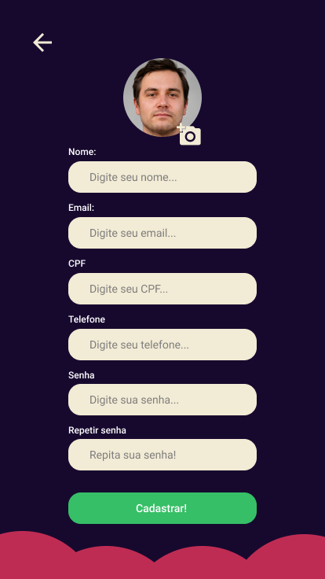
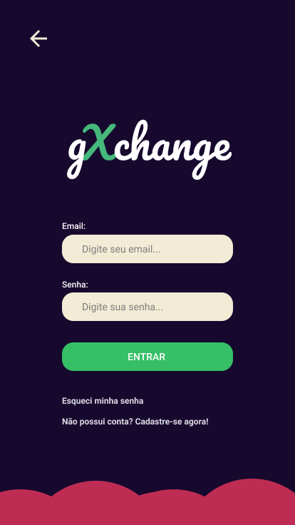
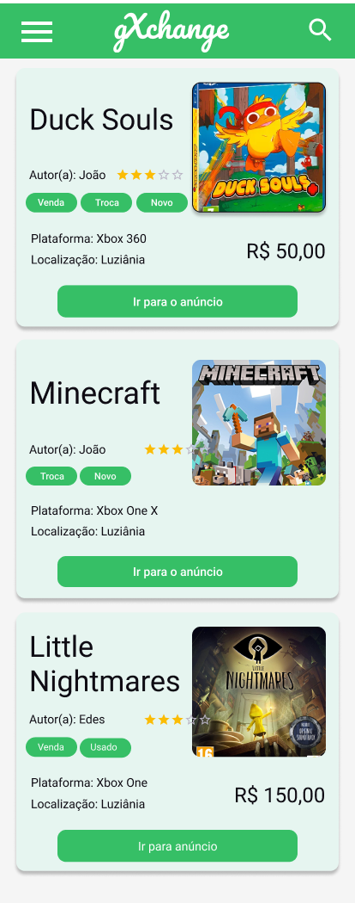
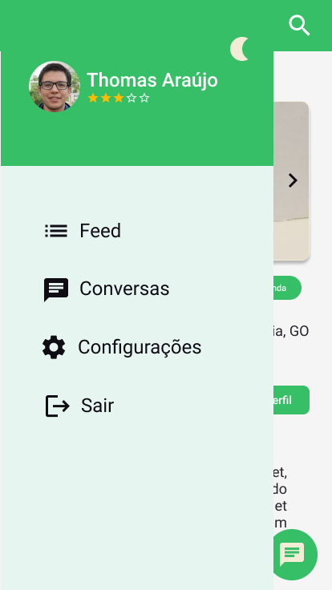
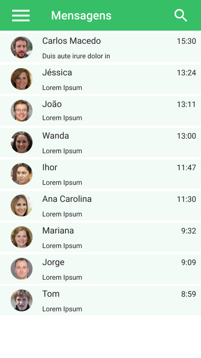
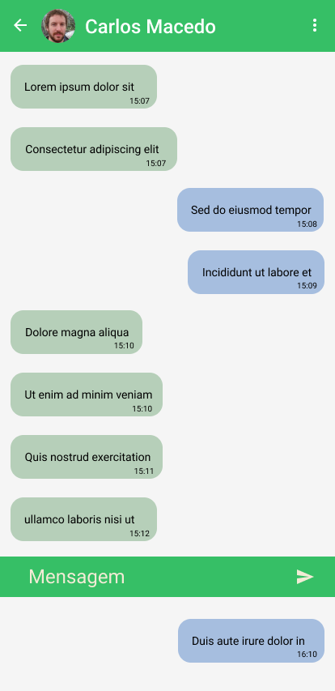

# Protótipo de alta fidelidade

## Protótipo interativo

<iframe style="border: 1px solid rgba(0, 0, 0, 0.1);" width="800" height="450" src="https://www.figma.com/embed?embed_host=share&url=https%3A%2F%2Fwww.figma.com%2Fproto%2FHHDDXocoxIRDL002Ic7uYZ%2FProt%25C3%25B3tipo-de-Alta-gXchange%3Fnode-id%3D2%253A9%26scaling%3Dscale-down" allowfullscreen></iframe>

## Protótipo imagens

### Pré login

### Cadastro

### Login

### Feed

### Anúncio

### Anúncio sidebar

### Conversas

### Chat

## Versionamento

| Versão | Data       | Modificação               | Motivo | Autor         |
| ------ | ---------- | ------------------------- | ------ | ------------- |
|  1.0   | 16/02/2021 | Criação do documento do protótipo de alta fidelidade | ter uma visão mais especifica do protótipo de alta fidelidade | Todos os integrantes |