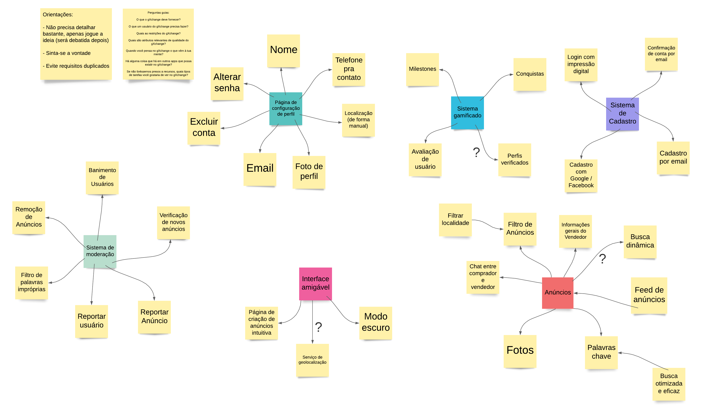
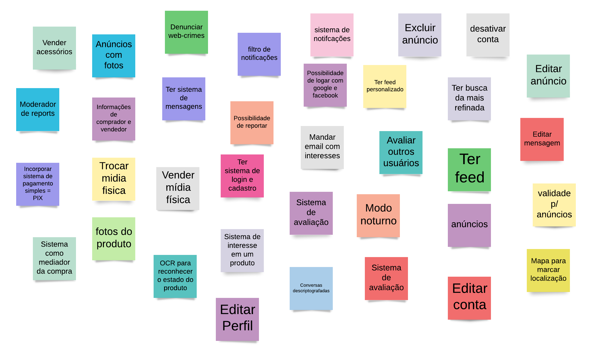

# Elicitação - Brainstorming

## Perguntas guia realizadas

- O que o gXchange deve fornecer?
- O que um usuário do gXchange precisa fazer?
- Quais as restrições do gXchange? Quais são atributos relevantes de qualidade do gXchange?
- Quando você pensa no gXchange o que vêm à tua mente?
- Há alguma coisa que há em outros apps que possa existir no gXchange?
- Se não tivéssemos presos a recursos, quais tipos de tarefas você gostaria de ver no gXchange?

## Sessão Assíncrona

Com o intuito de melhorar e tentar cobrir o máximo de ideias durante o <em>brainstorming</em>, optamos por criar um quadro para colocar as ideias, cada integrante pôde ir no quadro e escrever suas ideias.

Utilizamos também o <em>unpacking</em> do <em>design sprint</em> para prover ideias para o brainstorming.

### Resultados

O quadro utilizado para as ideias:

<a href="https://drive.google.com/file/d/1uWIksHPCQ-LmNPWzrg0t8apdG9k_WapB/view?usp=sharing" target="_blank" rel="noopener noreferrer">Link para a imagem</a>

O quadro realizando durante o unpack:

<a href="https://drive.google.com/file/d/1H8sKywsvaYAmn7sOsN99mRqZH5Q6O0MI/view?usp=sharing" target="_blank" rel="noopener noreferrer">Link para a imagem</a>

## Sessão Síncrona

Seguindo as mesmas perguntas guias, foi realizada uma sessão de brainstorming para:

- Retirar ambiguidades dos requisitos
- Debater ideias do quadro
- Extrair requisitos do quadro
- Elicitar requisitos faltantes
- Documentar requisitos elicitados

## Requisitos

### Funcionais

| Número | Requisito                                                                                                                                                                                                      |
| :----: | -------------------------------------------------------------------------------------------------------------------------------------------------------------------------------------------------------------- |
|   1    | O [usuário](../../lexico/#l7-usuario) deve ser capaz de realizar seu cadastro por email                                                                                                                        |
|   2    | O [usuário](../../lexico/#l7-usuario) deve ser capaz de realizar seu cadastro pelo facebook                                                                                                                    |
|   3    | O [usuário](../../lexico/#l7-usuario) deve ser capaz de realizar seu cadastro pelo google                                                                                                                      |
|   4    | O [usuário](../../lexico/#l7-usuario) deve ser capaz de alterar seu dados (email, nome, telefone, senha, endereço, foto de perfil)                                                                             |
|   5    | O [usuário](../../lexico/#l7-usuario) deve ser capaz de desativar sua conta                                                                                                                                    |
|   6    | O [usuário](../../lexico/#l7-usuario) deve ser capaz de excluir sua conta                                                                                                                                      |
|   7    | O [usuário](../../lexico/#l7-usuario) deve ser capaz de realizar login utilizando impressão digital                                                                                                            |
|   8    | O [comprador](../../lexico/#l7-usuario) deve ser capaz de [avaliar](../../lexico/#l5-avaliar) um [vendedor](../../lexico/#l7-usuario)                                                                          |
|   9    | O [vendedor](../../lexico/#l7-usuario) deve ser capaz de [avaliar](../../lexico/#l5-avaliar) um [comprador](../../lexico/#l7-usuario)                                                                          |
|   10   | O [usuário](../../lexico/#l7-usuario) deve ser capaz de [reportar](../../lexico/#l6-reportar) outro [usuário](../../lexico/#l7-usuario)                                                                        |
|   11   | O [vendedor](../../lexico/#l7-usuario) deve ser capaz de criar um [anúncio](../../lexico/#l1-anuncio)                                                                                                          |
|   12   | O [vendedor](../../lexico/#l7-usuario) deve ser capaz de adicionar fotos a um [anúncio](../../lexico/#l1-anuncio)                                                                                              |
|   13   | O [vendedor](../../lexico/#l7-usuario) deve ser capaz de adicionar palavras chave a um [anúncio](../../lexico/#l1-anuncio)                                                                                     |
|   14   | O [usuário](../../lexico/#l7-usuario) deve ser capaz de enviar mensagens para outros [usuários](../../lexico/#l7-usuario)                                                                                      |
|   15   | O [moderador](../../lexico/#l7-usuario) deve ser capaz de banir um [usuário](../../lexico/#l7-usuario)                                                                                                         |
|   16   | O [moderador](../../lexico/#l7-usuario) deve ser capaz de excluir um [anúncio](../../lexico/#l1-anuncio)                                                                                                       |
|   17   | O [usuário](../../lexico/#l7-usuario) deve ser capaz de visualizar um [anúncio](../../lexico/#l1-anuncio)                                                                                                      |
|   18   | O [usuário](../../lexico/#l7-usuario) deve ser capaz de filtrar os [anúncios](../../lexico/#l1-anuncio)                                                                                                        |
|   19   | O [comprador](../../lexico/#l7-usuario) e [vendedor](../../lexico/#l7-usuario) deve ser capaz de acessar o perfil de outros [compradores](../../lexico/#l7-usuario) e [vendedores].(./(./lexico/#l7-usuario)   |
|   20   | O [comprador](../../lexico/#l7-usuario) e [vendedor](../../lexico/#l7-usuario) deve ser capaz de bloquear mensagens de outros [compradores](../../lexico/#l7-usuario) e [vendedores].(./(./lexico/#l7-usuario) |
|   21   | O [usuário](../../lexico/#l7-usuario) deve ser capaz de interagir com o feed de [anúncios](../../lexico/#l1-anuncio)                                                                                           |
|   22   | O [usuário](../../lexico/#l7-usuario) deve ser capaz de escolher os tópicos de [anúncios](../../lexico/#l1-anuncio) que deseja visualizar no seu feed [**(a ser decidido)**](../padroes/#a-ser-decidido)       |
|   23   | O sistema deve utilizar reconhecimento de imagem nas fotos dos jogos para aferir a qualidade da mídia                                                                                                          |
|   24   | O sistema deve utilizar reconhecimento de imagem nas fotos de usuário e anúncios para filtrar imagens impróprias                                                                                               |

### Não Funcionais

| Número | Requisito                                                                                                                             |
| :----: | ------------------------------------------------------------------------------------------------------------------------------------- |
|   1    | O sistema deve enviar um e-mail de confirmação para o [usuário](../../lexico/#l7-usuario) após o cadastro                             |
|   2    | O sistema deve fornecer um modo noturno                                                                                               |
|   3    | O sistema deve possuir uma página de criação de anúncios intuitiva [**(a ser decidido)**](../padroes/#a-ser-decidido)                 |
|   4    | O sistema deve ser gamificado [**(a ser decidido)**](../padroes/#a-ser-decidido)                                                      |
|   5    | O sistema deve ser amigável [**(a ser decidido)**](../padroes/#a-ser-decidido)                                                        |
|   6    | O sistema deve possuir uma boa usabilidade [**(a ser decidido)**](../padroes/#a-ser-decidido)                                         |
|   7    | O sistema deve exibir somente perfis de [compradores](../../lexico/#l7-usuario) e [vendedores](../../lexico/#l7-usuario)              |
|   8    | O sistema deve filtrar palavras impróprias em [anúncios](../../lexico/#l1-anuncio) [**(a ser decidido)**](../padroes/#a-ser-decidido) |

## Referências

> BARBOSA, Simone; SILVA, Bruno. "Interação Humano-Computador". Elsevier Editora Ltda, 2010.

## Versionamento

| Versão | Data       | Modificação          | Motivo                                      | Autor                |
| ------ | ---------- | -------------------- | ------------------------------------------- | -------------------- |
| 1.0    | 17/02/2021 | Criação do documento | Elicitar os requisitos no escopo do projeto | Todos os integrantes |
