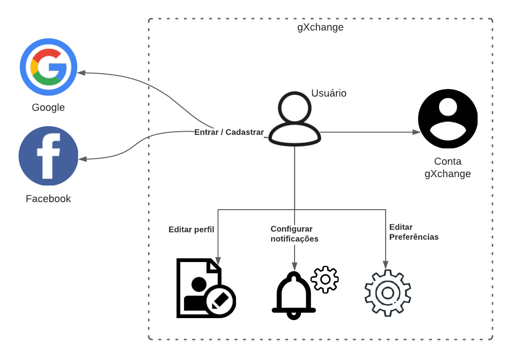

# Rich Picture

## Introdução

Rich picture é uma maneira de explorar, reconhecer e definir uma situação e expressá-la através de diagramas. No nosso caso o utilizamos com o intuito de definir melhor o escopo e o problema a ser resolvido pelo gXchange.

## Rich Picture de anúncios

<a href="https://drive.google.com/file/d/1jb8Efp-0fsOLo1cSm6k9DchTM2s3F_29/view?usp=sharing" target="_blank" rel="noopener">Link para a imagem</a>

## Rich Picture de Usuário

<a href="https://drive.google.com/file/d/11DUdIebt6Jp-Bh4KeXSd8bwn0hltE14Q/view?usp=sharing" target="_blank" rel="noopener">Link para a imagem</a>

## Referências Bibliográficas

>Rich Pictures. BetterEvaluation. Disponível em: https://www.betterevaluation.org/en/evaluation-options/richpictures, acesso em: 15 de out. de 2020.

## Versionamento

| Versão | Data       | Modificação                    | Motivo | Autor         |
| ------ | ---------- | -------------------------------| ------ | ------------- |
| [1.0](../../../../versoes/rich_picture/1.0/) | 17/02/2021 | Criação do documento | Documento de Rich Picture que foi realizado dia 09/02/2021 | Todos os integrantes |
| 2.0 | 18/02/2021 | Editando introdução | Para que ficasse melhor de compreender o propósito de uso do Rich Picture | Rhuan Queiroz |
