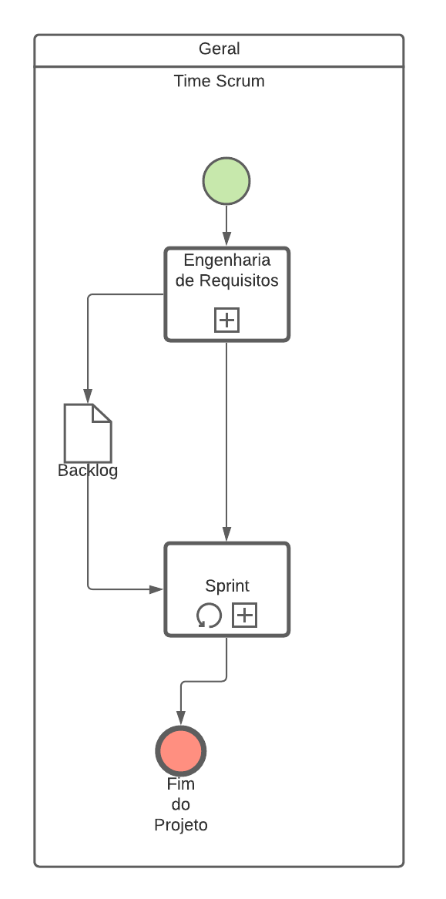
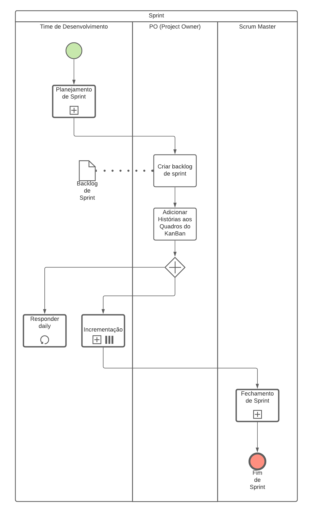
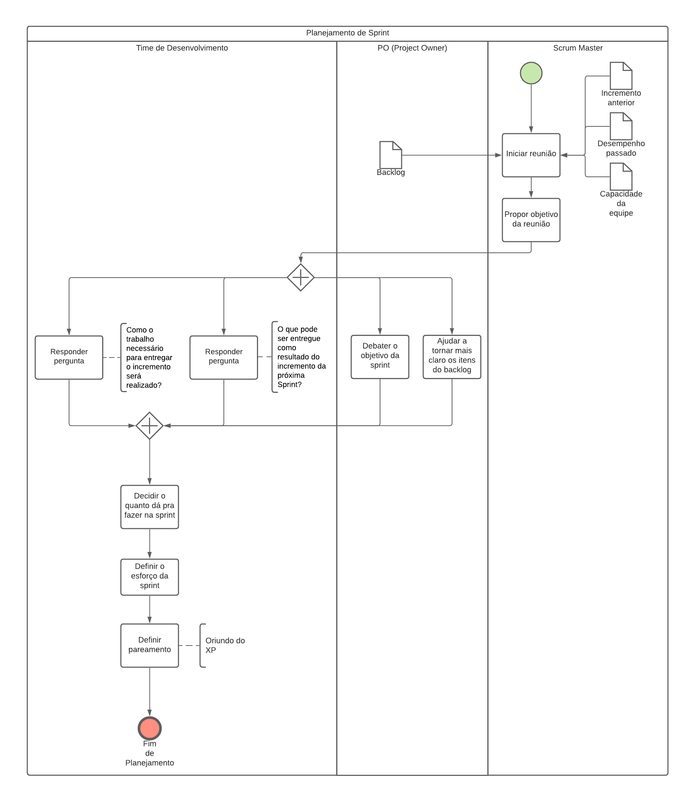
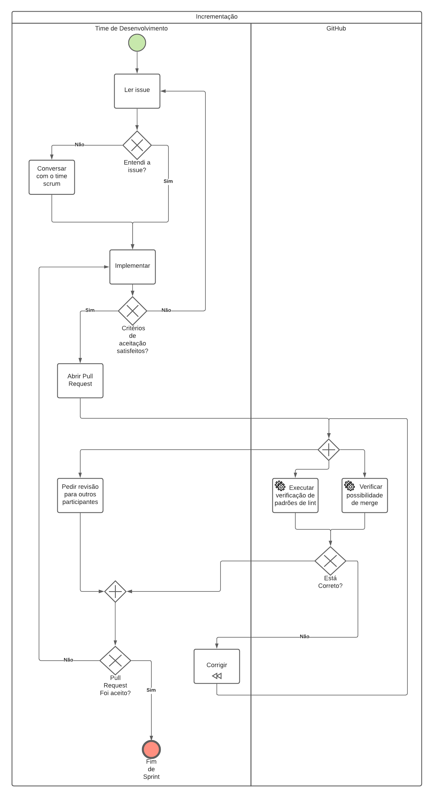
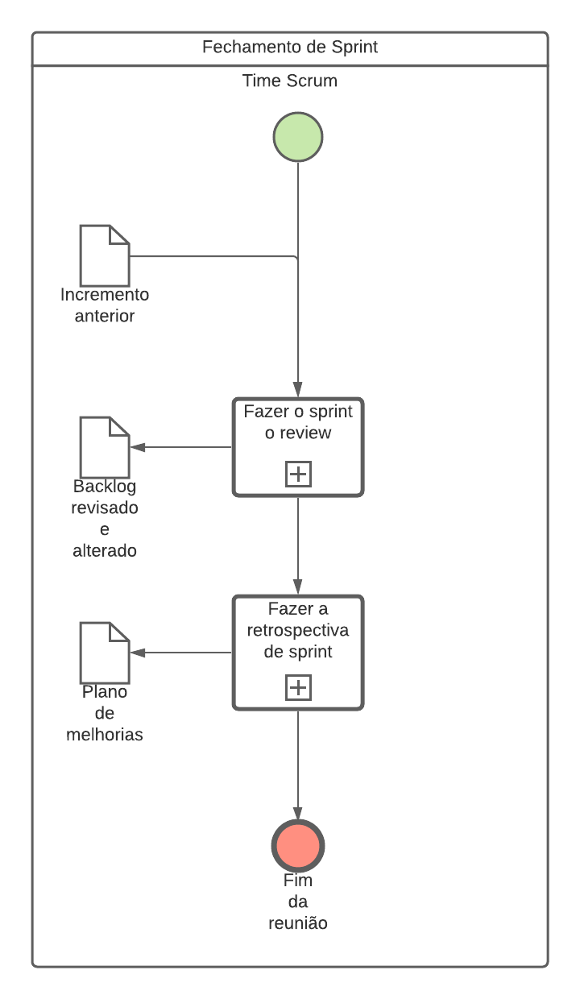

# BPMN

## Introdução

"O <i>Business Process Model and Notation</i> ou BPMN é uma notação da metodologia de gerenciamento de processos de negócio que tem como finalidade modelar formas de melhorar a eficiência, representar novas circunstâncias ou ganhar vantagem competitiva." (Lucidchart, 2018)

## Diagramas

### Geral

<a href="https://drive.google.com/file/d/1PHDlCUa7PCWjMdmeXPkYjLpSXYKqXnrc/view?usp=sharing" target="_blank" rel="noopener">Link para a imagem</a>

### Sprint

<a href="https://drive.google.com/file/d/1YrvUe60em0bA3XrWl9RVtlHGOcVapE3v/view?usp=sharing" target="_blank" rel="noopener">Link para a imagem</a>

### Planejamento de sprint

<a href="https://drive.google.com/file/d/1Lx1G7TReZOPH2Ro5l4c5JWYyoDQvjM0K/view?usp=sharing" target="_blank" rel="noopener">Link para a imagem</a>

### Incrementação

<a href="https://drive.google.com/file/d/1RiqIu4-ijHWmuFCZXY9i0J7kVlt50WVO/view?usp=sharing" target="_blank" rel="noopener">Link para a imagem</a>

### Fechamento de Sprint

<a href="https://drive.google.com/file/d/1AYYrlZN7u9WDY_TU93aacC47cjA9bdrW/view?usp=sharing" target="_blank" rel="noopener">Link para a imagem</a>

## Referências

>"O que é BPMN?". Lucidchart. Disponível em: https://www.lucidchart.com/pages/pt/o-que-e-bpmn#:~:text=Ele%20difere%20do%20mapeamento%20de,utilizada%20no%20design%20de%20software. Acesso em: 19 fev. 2021.

>"Curso de Mapeamento de Processos". Tribunal de Contas de União, 2013.

## Versionamento

| Versão | Data       | Modificação               | Motivo | Autor         |
| ------ | ---------- | ------------------------- | ------ | ------------- |
|  1.0   | 19/02/2021 | Criação do documento de BPMN | Modelar o uso das diferentes metodologias no projeto | Todos os integrantes |
