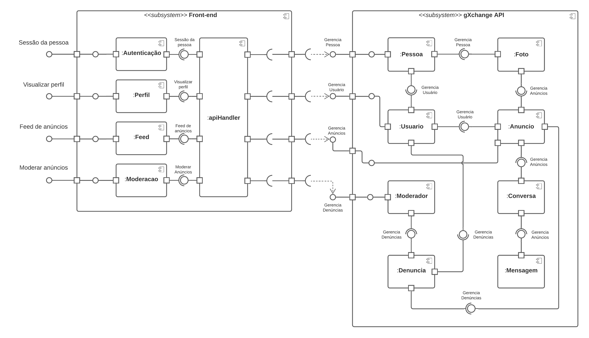

# Diagrama de Componentes

## Introdução

O diagrama de componentes mostra componentes, interfaces fornecidas e requisitadas, portas, e relacionamentos entre eles. Esse diagrama é usado no desenvolvimento baseado em componentes. O desenvolvimento baseado em componentes se baseia em uma suposição de que componentes previamente construídos podem ser reusados e também que componentes podem ser substituídos por outros componentes que sejam equivalentes ou compatível.

Os principal motivo pelo qual escolhemos adotar o diagrama de componentes foi porque ele nos ajuda a imaginar e compreender a estrutura do sistema, demonstrando como os diferentes componentes do sistema se relacionam.

## Discussões entre integrantes

Foi debatido entre os integrantes sobre a necessidade de especificar um componente de <em>handler</em> das requisições feitas para a API do sistema, e chegamos a um consenso de que era um componente relevante, pois ele seria utilizado por muitos outros componentes do sistema.

## Diagrama

<a href="https://drive.google.com/file/d/1xU5zW2MU66O0srtWuXSoXb3pZectBMDB/view?usp=sharing" target="_blank" rel="noopener">Link para a imagem</a>

## Referências

> Diagrama de componentes UML: o que é, como fazer e exemplos. Disponível em: https://www.lucidchart.com/pages/pt/diagrama-de-componentes-uml, acesso em 2 de mar. de 2021

> UML Component Diagrams. Disponível em: https://www.uml-diagrams.org/component-diagrams.html, acesso em 2 de mar. de 2021

## Versionamento

| Versão | Data       | Modificação               | Motivo | Autor         |
| ------ | ---------- | ------------------------- | ------ | ------------- |
|  1.0  | 02/03/2021 | Criação do documento de diagrama de componente | Criar um diagrama que indentifique os componentes presentes no projeto | Todos os integrantes |
|  1.0.1  | 03/03/2021 | Correção no titulo do documento | - | Marcelo Victor |
