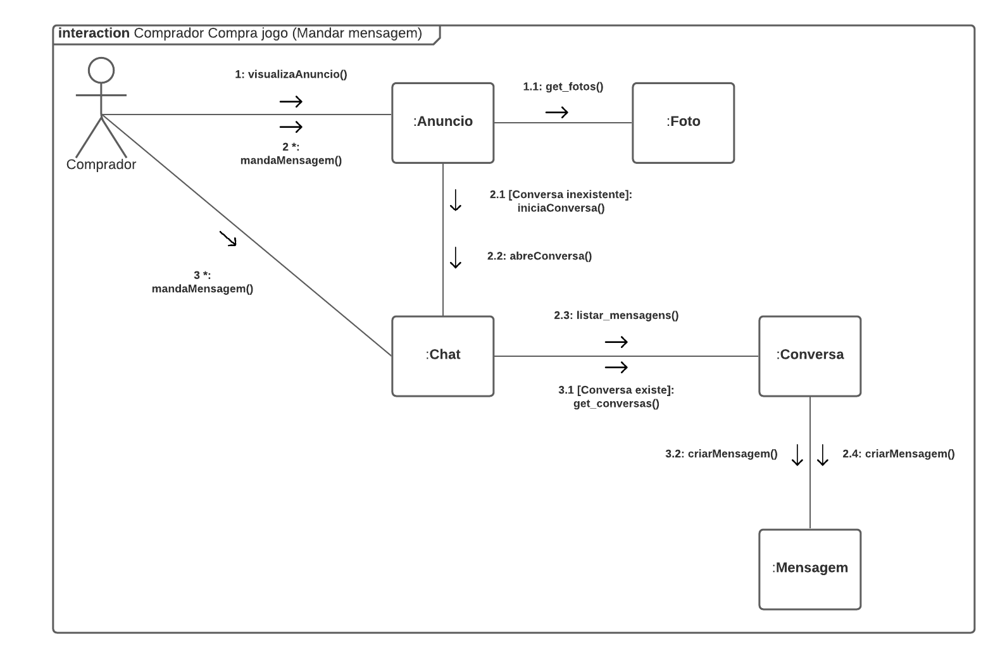
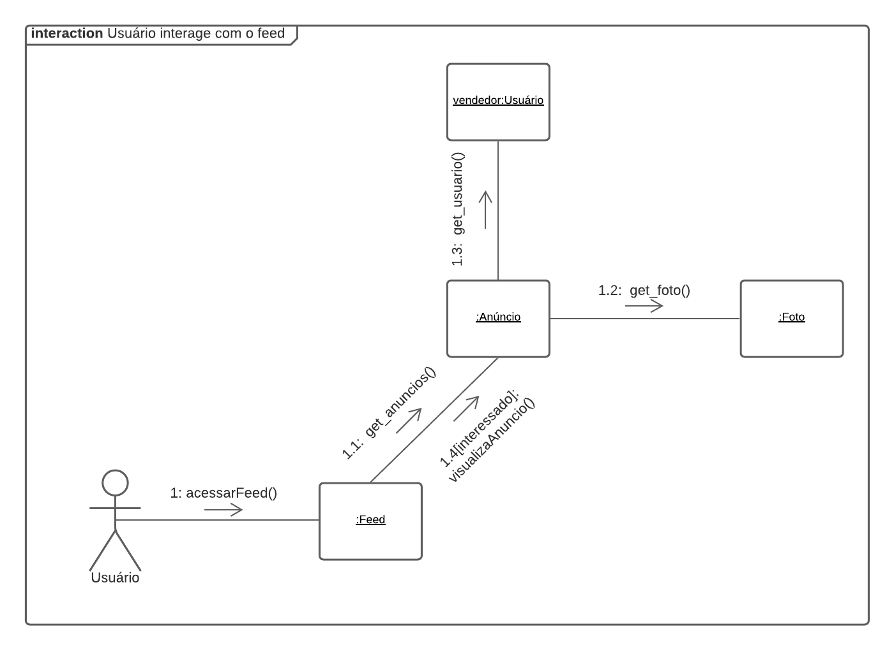
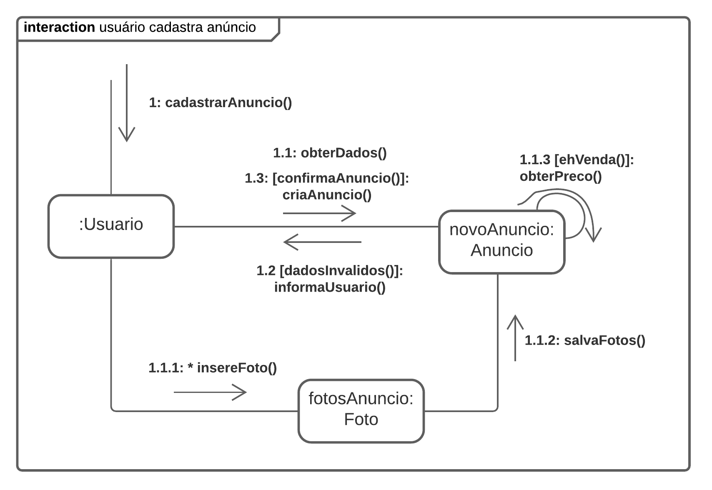

# Diagramas de comunicação

## Introdução

O diagrama de comunicação é um tipo de diagrama UML de integração que mostra interações entre objetos e/ou partes (representadas como <em>lifelines</em>) se utilizando de mensagens sequenciadas de maneira livre. Decidimos utilizar esse diagrama, pois ele explicita bem o relacionamento dos objetos utilizados no sistema, como eles se associam e se conectam através de mensagens.

## Diagramas

### Comprador Compra Jogo

#### Imagem do diagrama

<a href="https://drive.google.com/file/d/1RjEOq-vf9Rv9q31DDcsXMGqbLa4XrivG/view?usp=sharing" target="_blank" rel="noopener">Link para a imagem</a>

#### Versionamento
 Versão | Data       | Modificação                    | Motivo | Autor         |
| ------ | ---------- | -------------------------------| ------ | ------------- |
| 1.0 | 07/03/2021 | Adição do diagrama de comprador compra jogo | - | Rhuan Carlos e Washington Bispo |

### Usuário Interage com o Feed

#### Imagem do diagrama

<a href="https://drive.google.com/file/d/1gWzMhvVhW_SLew3KDGFdLjxUSDH9bvlY/view?usp=sharing" target="_blank" rel="noopener">Link para a imagem</a>

#### Versionamento
 Versão | Data       | Modificação                    | Motivo | Autor         |
| ------ | ---------- | -------------------------------| ------ | ------------- |
| 1.0 | 07/03/2021 | Adição do diagrama de usuário interage com o feed | - | Marcelo Victor e Thiago Guilherme |

### Vendedor Cadastra Anúncio

#### Imagem do diagrama

<a href="https://drive.google.com/file/d/1pw7HBokU5tYgwioNA7OdUWKpM2PpU8V6/view?usp=sharing" target="_blank" rel="noopener">Link para a imagem</a>

#### Versionamento
 Versão | Data       | Modificação                    | Motivo | Autor         |
| ------ | ---------- | -------------------------------| ------ | ------------- |
| 1.0 | 07/03/2021 | Adição do diagrama de vendedor cadastra anúncio | - | Igor Paiva e Thiago Lopes |

## Referências

>"UML Communication Diagrams Overview". UML-diagrams. Disponível em: https://www.uml-diagrams.org/communication-diagrams.html. Acesso em: 07 mar. 2021.

>"Communication Diagram Tutorial ". Lucidchart. Disponível em: https://www.lucidchart.com/pages/uml-communication-diagram. Acesso em: 07 mar. 2021.

## Versionamento
 Versão | Data       | Modificação                    | Motivo | Autor         |
| ------ | ---------- | -------------------------------| ------ | ------------- |
| 1.0 | 07/03/2021 | Criação do documento | - | Igor Paiva, Rhuan Carlos, Thiago Guilherme, Thiago Lopes, Washington Bispo |