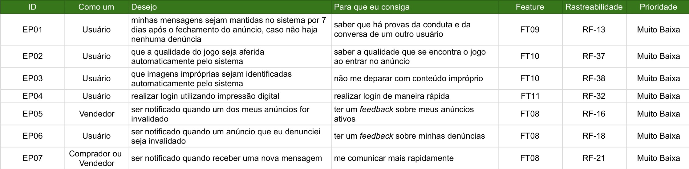
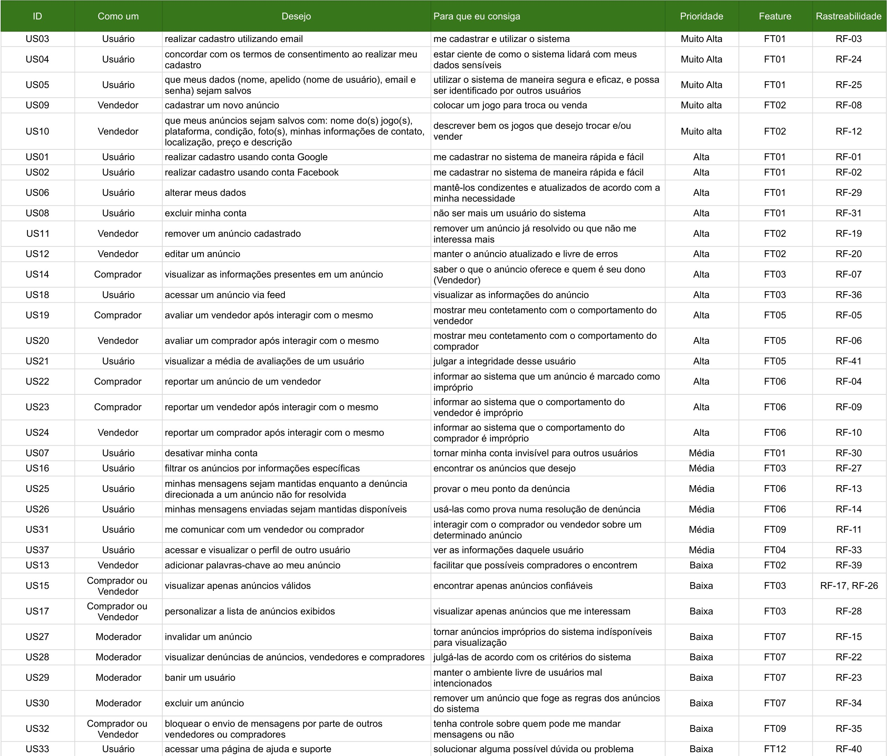

# Backlog do produto

## Introdução

O backlog de produto em um projeto ágil contém uma lista de demandas de trabalho que um time deve realizar. São normalmente compostos de histórias de usuário, mas alguns times também colocam outros requisitos, processos de negócio, e defeitos a serem corrigidos (Wiegers e Beatty, 2013).

"O Backlog do Produto é uma lista ordenada de tudo que deve ser necessário no produto, e é uma origem única dos requisitos para qualquer mudança a ser feita no produto. O Product Owner é responsável pelo Backlog do Produto, incluindo seu conteúdo, disponibilidade e ordenação." (SCHWABER e SUTHERLAND, 2014, p. 13).

## Backlog

Será convencionado os graus de granularidade do sistema como sendo:

- User Story (História de usuário): algo que pode ser desenvolvido em uma iteração (Sprint)
- Epic (Épico): pode ser um conjunto de histórias de usuário ou um conjunto de épicos menores
- Feature (funcionalidade): Grupo de capacidades do sistema que agregam valor ao usuário. Seja:
  - Uma história de usuário
  - Um conjunto de histórias de usuário
  - Um épico
  - Um conjunto de épicos

A planilha com o backlog pode ser encontrada <a href="https://docs.google.com/spreadsheets/d/1cwIyA45C8Xvj6mNrDmgCpoLtkpJnH1IgDXl2kX7muxc/edit?usp=sharing" target="_blank" rel="noopener noreferrer">aqui</a>

### Features

<a href="https://drive.google.com/file/d/1bBoo0xpIx6DzDPSCyxTpdAhgJjbD9Cqo/view?usp=sharing" target="_blank" rel="noopener noreferrer">Link para a imagem</a>

### Épicos

<a href="https://drive.google.com/file/d/1iDe37NllFQeHeoQFabc9UfBS2PsbVqu3/view?usp=sharing" target="_blank" rel="noopener noreferrer">Link para a imagem</a>

### Histórias de usuários

<a href="https://drive.google.com/file/d/1pchxOWUlJXaU2zS_M73hU8iZA6oQj7RH/view?usp=sharing" target="_blank" rel="noopener noreferrer">Link para a imagem</a>

## História de usuário

Uma história de usuário é uma curta e simples descrição de uma tarefa expressa na perspectiva da pessoa que deseja essa nova funcionalidade, normalmente um usuário ou cliente do sistema (Wiegers e Beatty, 2013).

Serão escritos da seguinte forma:
 
 
Eu, como um < TIPOS DE USUÁRIOS >, desejo < OBJETIVO > para que eu consiga < UMA RAZÃO >

## Prioridade

- Muito alta: requisitos priorizados utilizando o _First Things First_
- Alta: requisitos priorizados com o MoSCoW com prioridade _must_
- Média: requisitos priorizados com o MoSCoW com prioridade _should_
- Baixa: requisitos priorizados com o MoSCoW com prioridade _could_
- Muito baixa: requisitos priorizados com o MoSCoW com prioridade _won't_

## Features, épicos e histórias de usuário

### FT01 - Controle de conta

#### US01

Eu, como um usuário, desejo realizar cadastro usando conta Google para que eu consiga me cadastrar no sistema de maneira rápida e fácil.

Prioridade: Alta
v
Rastreabilidade: RF-01

Critérios de aceitação:

- Integração com a API do google
- Obtenção dos dados advindos da conta do google
- Os dados não provenientes da conta google são salvos?

#### US02

Eu, como um usuário, desejo realizar cadastro usando conta Facebook para que eu consiga me cadastrar no sistema de maneira rápida e fácil.

Prioridade: Alta

Rastreabilidade: RF-02

Critérios de aceitação:

- Integração com a API do Facebook
- Obtenção dos dados advindos da conta do Facebook
- Os dados não provenientes da conta Facebook são salvos?
- Utilizar mesma foto do facebook

#### US03

Eu, como um usuário, desejo realizar cadastro utilizando email para que eu consiga me cadastrar e utilizar o sistema.

Prioridade: Muito alta

Rastreabilidade: RF-03

Critérios de aceitação:

- A conta está sendo criada corretamente?
- Todos os dados necessários estão sendo coletados?
- A senha da conta possui mais que 8 caracteres?
- A senha contém ao menos uma letra maiúscula, um número e um caractere especial?
- O email é válido, ou seja, possui alias@domain?

#### US04

Eu, como um usuário, desejo concordar com os termos de consentimento ao realizar meu cadastro para que eu consiga estar ciente de como o sistema lidará com meus dados sensíveis.

Prioridade: Muilto alta

Rastreabilidade: RF-24

Critérios de aceitação:

- O termo de consentimento é exibido ao usuário durante o cadastro?
- O termo lista como o sistema usuará os dados do usuário?
- O termo lista como o sistema guardará os dados do usuário?
- Só é possível continuar o cadastro se o termo for aceito

#### US05

Eu, como um usuário, desejo que meus dados (nome, apelido (nome de usuário), email e senha) sejam salvos para que eu consiga utilizar o sistema de maneira segura e eficaz, e possa ser identificado por outros usuários.

Prioridade: Muito alta

Rastreabilidade: RF-25

Critérios de aceitação:

- Os dados estão salvos no sistema corretamente?
- Os dados utilizam os campos adequados, de modo a otimizar o espaço de armazenamento?
- A senha é salva criptografada?

#### US06

Eu, como um usuário, desejo alterar meus dados para que eu consiga mantê-los condizentes e atualizados de acordo com a minha necessidade.

Prioridade: Alta

Rastreabilidade: RF-29

Critérios de aceitação:

- Os dados são alterados corretamente?
- Apenas os dados modificados são enviados na requisição?
- A requisição utiliza o verbo http PATCH?
- Caso a senha seja alterada, a atual é solicitada?

#### US07

Eu, como um usuário, desejo desativar minha conta para que eu consiga tornar minha conta invisível para outros usuários.

Prioridade: Média

Rastreabilidade: RF-30

Critérios de aceitação:

- A senha é solicitada antes de concluir a ação?
- A senha fornecida é verificada?
- O estado da conta é alterado de fato?
- É possível reativar a conta?

#### US08

Eu, como um usuário, desejo excluir minha conta para que eu consiga não ser mais um usuário do sistema.

Prioridade: Alta

Rastreabilidade: RF-31

Critérios de aceitação:

- A senha é solicitada antes de concluir a ação?
- A senha fornecida é verificada?
- O estado da conta é alterado de fato?
- É feita a confirmação da ação por email?

### FT02 - Controle de Anúncios

#### US09

Eu, como um usuário, desejo cadastrar um novo anúncio para que eu consiga colocar um jogo para troca ou venda.

Prioridade: Muito alta

Rastreabilidade: RF-08

Critérios de aceitação:

- O anúncio é salvo na base de dados corretamente?
- Os campos necessários são informados?
- O anúncio é criado com o estado válido?

#### US10

Eu, como um vendedor, desejo que meus anúncios sejam salvos com: nome do(s) jogo(s), plataforma, condição, foto(s), minhas informações de contato, localização, preço e descrição para que eu consiga descrever bem os jogos que desejo trocar e/ou vender.

Prioridade: Muito alta

Rastreabilidade: RF-12

Critérios de aceitação:

- Os dados estão salvos no sistema corretamente?
- Os dados utilizam os campos adequados, de modo a otimizar o espaço de armazenamento?
- As fotos são enviadas corretamente?
- Possui pelo menos uma foto?

#### US11

Eu, como um vendedor, desejo remover um anúncio cadastrado para que eu consiga remover um anúncio já resolvido ou que não me interessa mais

Prioridade: Alta

Rastreabilidade: RF-19

Critérios de aceitação:

- O anúncio é deletado?
- O vendedor é informado que a tarefa foi concluída?
- Apenas é excluído se for válido?
- As conversas relacionadas ao anúncio são apagadas?

#### US12

Eu, como um vendedor, desejo editar um anúncio para que eu consiga manter o anúncio atualizado e livre de erros

Prioridade: Alta

Rastreabilidade: RF-20

Critérios de aceitação:

- Os dados são alterados corretamente?
- Só é possível editar um anúncio válido?
- É possível adicionar mais fotos ao anúncio?
- É garantido que ao menos uma foto permaneceu após a edição?
- Apenas os dados modificados são enviados na requisição?
- A requisição utiliza o verbo http PATCH?

#### US13

Eu, como um comprador, desejo adicionar palavras-chave ao meu anúncio para que eu consiga facilitar que possíveis compradores o encontrem

Prioridade: Baixa

Rastreabilidade: RF-39

Critérios de aceitação:

- As palavras-chave são armazenadas corretamente?
- Ao pesquisar uma palavra chave no campo de pesquisa, o resultado condiz com as espectativas?
- Somente as palavras chave disponíveis estão disponíveis para uso?

### FT03 - Feed de anúncios

#### US14

Eu, como um comprador, desejo visualizar as informações presentes em um anúncio para que eu consiga saber o que o anúncio oferece e quem é seu dono (Vendedor)

Prioridade: Alta

Rastreabilidade: RF-07

Critérios de aceitação:

- Só os anúncios válidos estão sendo mostrados no feed?
- Possui: título, foto principal, condição, preço (se aplicável), plataforma, se é troca ou venda
- O componente deve requisitar no máximo 30 anúncios por vez.
- Sempre que precisar o componente deve requisitar a próxima pagina de requisição.
- Apenas os dados necessários são retornados da requisição?

#### US15

Eu, como um vendedor, desejo visualizar apenas anúncios válidos para que eu consiga encontrar apenas anúncios confiáveis

Prioridade: Baixa

Rastreabilidade: RF-17 e RF-26

#### US16

Eu, como um usuário, desejo filtrar os anúncios por informações específicas para que eu consiga encontrar os anúncios que desejo

Prioridade: Média

Rastreabilidade: RF-27

#### US17

Eu, como um comprador, desejo personalizar a lista de anúncios exibidos para que eu consiga visualizar apenas anúncios que me interessam

Prioridade: Baixa

Rastreabilidade: RF-28

#### US18

Eu, como um comprador, desejo acessar um anúncio via feed para que eu consiga visualizar as informações do anúncio

Prioridade: Alta

Rastreabilidade: RF-36

Critérios de aceitação:

- Todos os dados relevantes estão disponíveis?
- É possível acessar o anúncio?
- Todas as informações do anúncio são informadas?
- É possível navegar pelas fotos do anúncio?

### FT04 - Perfil de usuário

#### US37

Eu, como um usuário, desejo acessar e visualizar o perfil de outro usuário para que eu consiga ver as informações daquele usuário

Prioridade: Média

Rastreabilidade: RF-33

### FT05 - Avaliação de usuário

#### US19

Eu, como um comprador, desejo avaliar um vendedor após interagir com o mesmo para que eu consiga mostrar meu contetamento com o comportamento do vendedor

Prioridade: Alta

Rastreabilidade: RF-05

Critérios de aceitação:

- Só é possível avaliar após uma interação?
- Antes de enviar a avaliação é pedido confirmação?
- Foi colocada alguma nota das disponíveis (1 a 5)?
- A média das notas é atualizada após a inserção de uma nova avaliação?

#### US20

Eu, como um vendedor, desejo avaliar um comprador após interagir com o mesmo para que eu consiga mostrar meu contetamento com o comportamento do comprador

Prioridade: Alta

Rastreabilidade: RF-06

Critérios de aceitação:

- Só é possível avaliar após uma interação?
- Antes de enviar a avaliação é pedido confirmação?
- Foi colocada alguma nota das disponíveis (1 a 5)?
- A média das notas é atualizada após a inserção de uma nova avaliação?

#### US21

Eu, como um usuário, desejo visualizar a média de avaliações de um usuário para que eu consiga julgar a integridade desse usuário

Prioridade: Alta

Rastreabilidade: RF-41

Critérios de aceitação:

- A maneira de apresentação da avaliação é condizente com a realidade do usuário?
- A média é exibida junto com o número de avaliações?

### FT06 - Denúncias do usuário

#### US22

Eu, como um usuário, desejo reportar um anúncio de um vendedor para que eu consiga julgar a integridade desse usuário

Prioridade: Alta

Rastreabilidade: RF-04

Critérios de aceitação:

- O sistema mostra opções de denúncia mais comuns, porém possibilita um campo para outros?
- É possível adicionar um comentário?
- É pedido confirmação do usuário para concluir a denúncia?
- Um feedback visual é mostrado ao usuário após a conclusão da denúncia?

#### US23

Eu, como um usuário, desejo reportar um comprador após interagir com o mesmo para que eu consiga informar ao sistema que o comportamento do comprador é impróprio

Prioridade: Alta

Rastreabilidade: RF-09

Critérios de aceitação:

- O sistema mostra opções de denúncia mais comuns, porém possibilita um campo para outros?
- É possível adicionar um comentário?
- É pedido confirmação do usuário para concluir a denúncia?
- Um feedback visual é mostrado ao usuário após a conclusão da denúncia?

#### US24

Eu, como um usuário, desejo reportar um vendedor após interagir com o mesmo para que eu consiga informar ao sistema que o comportamento do vendedor é impróprio

Prioridade: Alta

Rastreabilidade: RF-10

Critérios de aceitação:

- O sistema mostra opções de denúncia mais comuns, porém possibilita um campo para outros?
- É possível adicionar um comentário?
- É pedido confirmação do usuário para concluir a denúncia?
- Um feedback visual é mostrado ao usuário após a conclusão da denúncia?

#### US25

Eu, como um usuário, desejo minhas mensagens sejam mantidas enquanto a denúncia direcionada a um anúncio não for resolvida para que eu consiga provar o meu ponto da denúncia

Prioridade: Média

Rastreabilidade: RF-13

#### US26

Eu, como um vendedor, desejo minhas mensagens enviadas sejam mantidas disponíveis para que eu consiga usá-las como prova numa resolução de denúncia

Prioridade: Média

Rastreabilidade: RF-14

### FT07 - Moderador do sistema

#### US27

Eu, como um moderador, desejo invalidar um anúncio para que eu consiga tornar anúncios impróprios do sistema indísponíveis para visualização

Prioridade: Baixa

Rastreabilidade: RF-15

#### US28

Eu, como um moderador, desejo visualizar denúncias de anúncios, vendedores e compradores para que eu consiga julgá-las de acordo com os critérios do sistema

Prioridade: Baixa

Rastreabilidade: RF-22

#### US29

Eu, como um moderador, desejo banir um usuário para que eu consiga manter o ambiente livre de usuários mal intencionados

Prioridade: Baixa

Rastreabilidade: RF-23

#### US30

Eu, como um moderador, desejo excluir um anúncio para que eu consiga remover um anúncio que foge as regras dos anúncios do sistema

Prioridade: Baixa

Rastreabilidade: RF-34

### FT08 - Notificar usuário

#### EP05

Eu, como um vendedor, desejo ser notificado quando um dos meus anúncios for invalidado para que eu consiga ter um feedback sobre meus anúncios ativos

Prioridade: Muito baixa

Rastreabilidade: RF-16

#### EP06

Eu, como um usuário, desejo ser notificado quando um dos meus anúncios for invalidado para que eu consiga ter um feedback sobre meus anúncios ativos

Prioridade: Muito baixa

Rastreabilidade: RF-18

#### EP07

Eu, como um comprador ou vendedor, desejo ser notificado quando receber uma nova mensagem para que eu consiga me comunicar mais rapidamente

Prioridade: Muito baixa

Rastreabilidade: RF-21

### FT09 - Chat de usuários

#### US31

Eu, como um moderador, desejo me comunicar com um vendedor ou comprador para que eu consiga interagir com o comprador ou vendedor sobre um determinado anúncio

Prioridade: Média

Rastreabilidade: RF-11

#### US32

Eu, como um moderador, desejo bloquear o envio de mensagens por parte de outros vendedores ou compradores para que eu consiga tenha controle sobre quem pode me mandar mensagens ou não

Prioridade: Baixa

Rastreabilidade: RF-35

#### EP01

Eu, como um usuário, desejo minhas mensagens sejam mantidas no sistema por 7 dias após o fechamento do anúncio, caso não haja nenhuma denúncia para que eu consiga tenha controle sobre quem pode me mandar mensagens ou não

Prioridade: Muito Baixa

Rastreabilidade: RF-13

### FT10 - Qualidade de mídia

#### EP02

Eu, como um usuário, desejo que a qualidade do jogo seja aferida automaticamente pelo sistema para que eu consiga saber a qualidade que se encontra o jogo ao entrar no anúncio.

Prioridade: Muito baixa

Rastreabilidade: RF-37

#### EP03

Eu, como um usuário, desejo que imagens impróprias sejam identificadas automaticamente pelo sistema para que eu consiga não me deparar com conteúdo impróprio

Prioridade: Muito baixa

Rastreabilidade: RF-38

### FT11 - Qualidade de mídia

#### EP04

Eu, como um usuário realizar login utilizando impressão digital para que eu consiga realizar login de maneira rápida.

Prioridade: Muito Baixa

Rastreabilidade: RF-32

### FT12 - Ajuda e suporte

#### US33

Eu, como um usuário desejo acessar uma página de ajuda e suporte para que eu consiga solucionar alguma possível dúvida ou problema.

Prioridade: Baixa

Rastreabilidade: RF-40

## Referências

> WIEGERS, Karl; BEATTY, Joy. "Software Requirements ". Microsoft Press, 2013.

> SCHWABER, Ken; SUTHERLAND, Jeff. “Guia do Scrum - Um guia definitivo para o Scrum: As regras do jogo”. Scrum.Org and ScrumInc , 2014.

## Versionamento

| Versão | Data       | Modificação                                        | Motivo                                                   | Autor                                                                        |
| ------ | ---------- | -------------------------------------------------- | -------------------------------------------------------- | ---------------------------------------------------------------------------- |
| 1.0    | 07/03/2021 | Criação do documento                               | Criar um backlog de produto                              | Igor Paiva, Rhuan Queiroz, Thiago Guilherme, Thiago Lopes e Washington Bispo |
| 1.1    | 28/03/2021 | Correção tipo de usuário das histórias US04 E US05 | Tornar mais claro a compreensão das histórias de usuário | Marcelo Victor                                                               |
