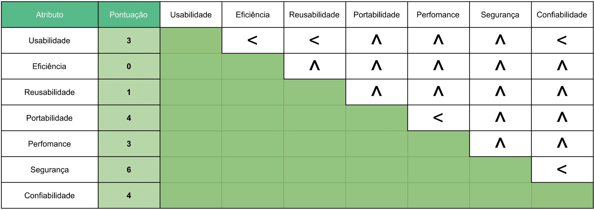

# Atributos de Qualidade

## Introdução

Para compreender e definir as relações e expectativas dos atributos de qualidade do sistema, nós decidimos explorar os atributos de qualidade do sistema para obter requisitos de qualidade bem estruturados e definidos. O método utilizado foi baseado no método proposto por Wiegers e Beatty (2013).

## Palavras-chave

&emsp;[Vendedor](../../../../desenho/base/1.1/lexico/#l7-usuario), [Usuário](../../../../desenho/base/1.1/lexico/#l7-usuario), [Anúncio](../../../../desenho/base/1.1/lexico/#l1-anuncio), usabilidade, eficiência, reusabilidade, portabilidade, perfomance, segurança, confiabilidade, qualidade. 

## Passo 1: começar com um escopo abrangente

- Usabilidade
- Eficiência
- Escalabilidade
- Reusabilidade
- Portabilidade
- Perfomance
- Integridade
- Robustez
- Segurança
- Verificalidade
- Confiabilidade

## Passo 2: reduzir o escopo

- Usabilidade
- Eficiência
- Reusabilidade
- Portabilidade
- Perfomance
- Segurança
- Confiabilidade

## Passo 3: priorizar a lista

<a href="https://docs.google.com/spreadsheets/d/1Z3TVb3Io3E38iAOlmLomPeSf6-t7rFuA-8N5NlZJESg/edit?usp=sharing" target="_blank" rel="noopenner">Link para a planilha</a>

## Passo 4: elicitar expectativas específicas para cada atributo

### Usabilidade

- A estrutura das tarefas do sistema devem estar bem definidas e simples;
- Promover a eficiência do usuário em primeiro lugar, em relação a do computador;
- Deve haver correspondência entre o sistema e as expectativas dos usuários;
- O sistema deve ajudar o usuário a se recuperar de um erro, informando-lhe sobre o que ocorreu;
- O sistema deve fornecer um equilíbrio entre o controle e liberdade do usuário;
- O modelo conceitual da interface deve prezar por consistência, para facilitar o aprendizado do sistema;
- O sistema deve manter um padrão e consistência em relação a esse padrão definido;
- O sistema deve tornar visível para os usuários o que é possível realizar e como as ações devem ser feitas.

### Eficiência

- Os algoritmos do sistema devem ser pensados na melhor complexidade computacional possível.

### Reusabilidade

- Os componentes do sistema sempre que possível devem ser construídos voltado ao reúso.

### Portabilidade

- O sistema deve funcionar nos navegadores WEB, tanto do Android quanto do iOS;

### Perfomance

- As animações do sistema devem ser executadas no máximo em 1s;
- As requisições do sistema devem ser respondidas em no máximo 5s;
- As páginas WEB devem carregar de rapidamente dada uma conexão regular 

### Segurança

- Os dados sensíveis serão sempre criptografados;
- Mudanças de senha devem primeiramente confirmar a senha atual do usuário;
- Desativação de conta devem primeiramente confirmar a senha atual do usuário;
- Exclusão de conta deve ser confirmada por e-mail;

### Confiabilidade

- O sistema deve se recuperar de 90% das falhas;
- O sistema deve se recuperar de uma falha simples em menos de 10s;
- O sistema deve se recuperar de uma falha catastrófica em menos de 2 dias;

## Passo 5: especificar requisitos de qualidade bem estruturados

| Número | Requisito | Atributo de qualidade |
|:--:|--|--|
| 1 | O vendedor com experiência deve ser capaz de cadastrar um anúncio, desconsiderando o tempo para realizar as fotografias, em uma média de tempo de 8 minutos, com um máximo de 12 minutos, 90% das vezes | Usabilidade |
| 2 | O sistema deve reutilizar os componentes já criados que se encaixem na tarefa necessária | Usabilidade, Reusabilidade |
| 3 | O sistema deve utilizar um conjunto de ícones e *assets* padronizados, sempre com o mesmo propósito | Usabilidade, Reusabilidade |
| 4 | O sistema deve informar erros em campos no formulário de cadastro de anúncio | Usabilidade |
| 5 | O sistema deve informar erros com uma janela de tempo de no máximo 5 segundos | Usabilidade, Perfomance |
| 6 | O sistema deve submeter requisições apenas se os campos forem válidos e estiverem corretos | Usabilidade, Perfomance |
| 7 | O sistema deve permitir ao usuário cancelar a tarefa em execução antes da conclusão de pelo menos 50% da mesma | Usabilidade |
| 8 | Antes de realizar uma requisição durante uma tarefa o sistema deve permitir ao usuário cancelar a tarefa | Usabilidade |
| 9 | Os componentes do sistema devem resolver os problemas utilizando a menor quantidade de operações possível, no máximo 70% do processamento destinado a ele | Performance, Eficiência |
| 10 | Os componentes do sistema devem resolver os problemas utilizando a menor quantidade de memória possível, no máximo 70% da memória destinado a ele | Performance, Eficiência |
| 11 | O sistema deve solicitar um *CAPTCHA* sempre que o usuário errar a senha por 2 ou mais vezes consecutivas | Segurança |
| 12 | O sistema deve solicitar a senha atual do usuário antes de desativar ou excluir a conta  | Segurança |
| 13 | O sistema deve solicitar confirmação do usuário por email antes de excluir a conta | Segurança |
| 14 | O sistema deve ser eficaz em navegadores modernos, como Google Chrome, Mozilla Firefox, Microsoft Edge, Opera GX e Safari | Portabilidade |
| 15 | O sistema deve carregar as páginas WEB em no máximo 10 segundos, dada uma rede de 10 ou mais megabits por segundo | Eficiência, Performance |
| 16 | O sistema deve responder requisições em no máximo 5 segundos estritos | Eficiência, Performance |
| 17 | O sistema deve recuperar os objetos do SGBD em no máximo 3 segundos | Eficiência, Performance |
| 18 | O sistema não deve falhar em responder as requisições mais que 5 vezes em 1000 casos | Confiabilidade |
| 19 | Os componentes do sistema não devem falhar mais do que uma vez entre 30 dias | Confiabilidade |
| 20 | Os componentes do sistema devem se recuperar de uma falha simples em menos de 10s | Confiabilidade |

## Referências

>WIEGERS, Karl; BEATTY, Joy. "Software Requirements". Microsoft Press, 2013.

>BARBOSA, Simone; SILVA, Bruno. "Interação Humano-Computador". Elsevier Editora Ltda, 2010.

## Versionamento

| Versão | Data       | Modificação               | Motivo | Autor         |
| ------ | ---------- | ------------------------- | ------ | ------------- |
|  1.0   | 05/03/2021 | Criação do documento | - | Igor Paiva, Rhuan Queiroz, Thiago Guilherme, Thiago Lopes e Washington Bispo |
