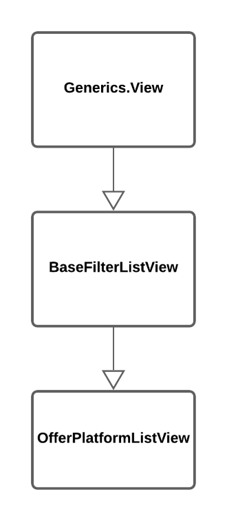

# Template Method - Django REST Framework Views

## Problema

<p style="text-indent: 20px; text-align: justify">
Como podemos alterar apenas um pequeno comportamento, no caso um método, de uma django REST Framework Generic View?
</p>

## Solução

<p style="text-indent: 20px; text-align: justify">
O framework Django Rest permite que alguns métodos específicos das Views sejam alteradas quando necessário, ou seja, fazendo-o por meio de um Template Method.
</p>

## Modelagem



<a href="https://drive.google.com/file/d/100XWp0vcGbhY5XbK5RZO0qEtYOjSucK9/view?usp=sharing" target="_blank" rel="noopener noreferrer">Link para a imagem</a>

## Código

```python
"""
    As views existentes dentro de generics do Django Rest por si só podem ser consideradas templates
"""
class BaseFilterListView(generics.ListAPIView):
    @abstract_method
    def get_queryset(self): # método que deiew(BaseFilterListView):
    """
        View que lista todas os anúncios com uma dada plataforma
    """
    serializer_class = OfferSerializer # Serializer de Anúncio, com os campos padrão de anúncio
    def get_queryset(self):
        platform = self.kwargs['platform']
        return Offer.objects.filter(platform=platform)
```

## Versionamento

| Versão | Data       | Modificação                                  | Motivo                                         | Autor                |
| ------ | ---------- | -------------------------------------------- | ---------------------------------------------- | -------------------- |
| 1.0    | 04/04/2021 | Criação do documento                         | -                                              | Todos os integrantes |
| 1.1    | 08/04/2021 | Alteração da solução e inclusão da modelagem | Para que esteja documentado a modelagem do GOF | Marcelo Victor       |
