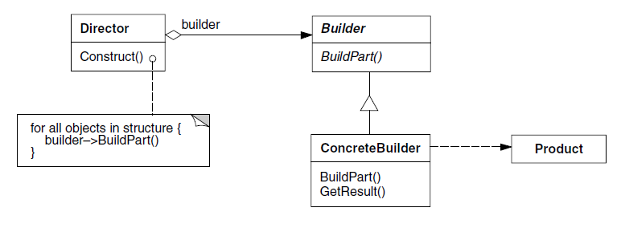
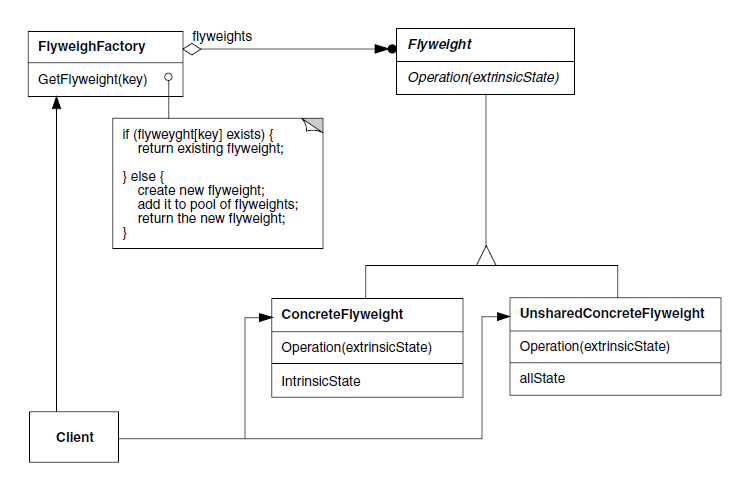
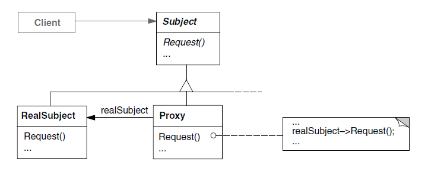

# GOFs

São um grupo de padrões de projeto que contém 23 padrões bem documentados divididos em três categorias: criacionais, estruturais e comportamentais.

## Criacionais

"Os padrões de criação abstraem o processo de instanciação. Eles ajudam a tornar um sistema independente de como seus objetos são criados, compostos e representados. Um padrão de criação de classe usa a herança para variar a classe que é instanciada, enquanto que um um padrão de criação de objeto delegará a instanciação para outro objeto." (GAMMA, 2000, p. 91).

### Builder

**Intenção**: Separar a construção de um objeto complexo da sua representação de modo que o mesmo processo de construção possa criar diferentes representações.

**Aplicabilidade**: Use o padrão Builder quando:

- o algoritmo para criação de um objeto complexo deve ser independente das partes que compõem o objeto e de como elas são montadas.
- o processo de construção deve permitir diferentes representações para o objeto que é construído.

**Estrutura**:

GAMMA, Erich; HELM, Richard; JOHNSON, Ralph; VLISSID0000ES, John. "Padrões de projeto: soluções reutilizáveis de software orientado a objetos". Artmed Editora S.A, 2000. Página 105.

[Link para a imagem](https://drive.google.com/file/d/1f7VS0oZSOWlh5P5sncPWB5cVdlRhn0KO/view?usp=sharing)

### Prototype

**Intenção**: Especificar os tipos de objetos a serem criados usando uma instância-protótipo e criar novos objetos pela cópia desse protótipo.

**Aplicabilidade**: Use o padrão Prototype quando:

- um sistema tiver que ser independente de como os seus produtos são criados, compostos e representados; e
- quando as classes a instanciar forem especificadas em tempo de execução, por exemplo, por carga dinâmica; ou
- para evitar a construção de uma hierarquia de classes de fábricas paralela à hierarquia de classes de produto; ou
- quando as instâncias de uma classe puderem ter uma dentre poucas combinações diferentes de estados. Pode ser mais conveniente instalar um número correspondente de protótipos e cloná-los, ao invés de instanciar a classe manualmente, cada vez com um estado apropriado.

**Estrutura**:

GAMMA, Erich; HELM, Richard; JOHNSON, Ralph; VLISSID0000ES, John. "Padrões de projeto: soluções reutilizáveis de software orientado a objetos". Artmed Editora S.A, 2000. Página 123.

[Link para a imagem](https://drive.google.com/file/d/15LLcURZ5R1Hv_0-pbYU_8-4NkCZthwxI/view?usp=sharing)

### Singleton

**Intenção**: Garantir que uma classe tenha somente uma instância e fornecer um ponto global de acesso para a mesma.

**Aplicabilidade**: Use o padrão Singleton quando:

- for preciso haver apenas uma instância de uma classe, e essa instância tiver que dar acesso aos clientes através de um ponto bem conhecido;
- a única instância tiver de ser extensível através de subclasses, possibilitando aos clientes usar uma instância estendida sem alterar o seu código.

**Estrutura**:

GAMMA, Erich; HELM, Richard; JOHNSON, Ralph; VLISSID0000ES, John. "Padrões de projeto: soluções reutilizáveis de software orientado a objetos". Artmed Editora S.A, 2000. Página 130.

[Link para a imagem](https://drive.google.com/file/d/1ocLwB7MZIYhphaANRP9soWtmGmHoOw9W/view?usp=sharing)

## Estruturais

"Os padrões estruturais se preocupam com a forma como classes e objetos são compostos para formar estruturas maiores. Os padrões estruturais de classes utilizam a herança para compor interfaces ou implementações. Dando um exemplo simples, considere como a herança múltipla mistura duas ou mais classes em uma outra. O resultado é uma classe que combina as propriedades das suas classes ancestrais. Esse padrão é particularmente útil para fazer bibliotecas de classes desenvolvidas independentemente trabalharem juntas"(GAMMA, 2000, p. 139).

### Adapter

**Intenção**: Converter a interface de uma classe em outra interface, esperada pelos clientes. O Adapter permite que classes com interfaces incompatíveis trabalhem em conjunto – o que, de outra forma, seria impossível.

**Aplicabilidade**: Use o padrão Adapter quando:

- você quiser usar uma classe existente, mas sua interface não corresponder à interface de que necessita;
- você quiser criar uma classe reutilizável que coopere com classes não-relacionadas ou não-previstas, ou seja, classes que não necessariamente tenham interfaces compatíveis;
- (somente para adaptadores de objetos) você precisar usar várias subclasses existentes, porém, for impraticável adaptar essas interfaces criando subclasses para cada uma. Um adaptador de objeto pode adaptar a interface da sua classe-mãe.

**Estrutura**:

GAMMA, Erich; HELM, Richard; JOHNSON, Ralph; VLISSID0000ES, John. "Padrões de projeto: soluções reutilizáveis de software orientado a objetos". Artmed Editora S.A, 2000. Página 142.

[Link para a imagem](https://drive.google.com/file/d/1B4fO2WYlYPcX3Knu5EA7Dzyq49K9DRdg/view?usp=sharing)

### Facade

**Intenção**: Fornecer uma interface unificada para um conjunto de interfaces em um subsistema. Os subsistemas se tornam mais complexos à medida que evoluem. Façade define uma interface de nível mais alto que torna o subsistema mais fácil de ser usado.

**Aplicabilidade**: Use o padrão Facade quando:

- Você deseja fornecer uma interface simples para um subsistema complexo. A maioria dos padrões, quando aplicados, resulta em mais e menores classes aumentando a complexidade;
- Existirem muitas dependências entre clientes e classes de implementação de uma abstração;
- Quando se deseja estruturar seus subsistemas em camadas. Use um facade para definir o ponto de entrada para cada nível de subsistema.

**Estrutura**:

GAMMA, Erich; HELM, Richard; JOHNSON, Ralph; VLISSID0000ES, John. "Padrões de projeto: soluções reutilizáveis de software orientado a objetos". Artmed Editora S.A, 2000. Página 181.

[Link para a imagem](https://drive.google.com/file/d/12RI9P1Cb_3ADRJDbi2iFSDoF5Liwhxe_/view?usp=sharing)

### Flyweight

**Intenção**: Usar compartilhamento para suportar eficientemente grandes quantidades de objetos de granularidade fina.

**Aplicabilidade**: eficiência do padrão Flyweight depende muito de como e onde ele é usado. Aplique o padrão Flyweight quando todas as condições a seguir forem verdadeiras:

- uma aplicação utiliza um grande número de objetos;
- os custos de armazenamento são altos por causa da grande quantidade de objetos;
- a maioria dos estados de objetos pode ser tornada extrínseca;
- muitos grupos de objetos podem ser substituídos por relativamente poucos objetos compartilhados, uma vez que estados extrínsecos são removidos;
- a aplicação não depende da identidade dos objetos. Uma vez que objetos Flyweights podem ser compartilhados, testes de identidade produzirão o valor verdadeiro para objetos conceitualmente distintos.

**Estrutura**:

GAMMA, Erich; HELM, Richard; JOHNSON, Ralph; VLISSID0000ES, John. "Padrões de projeto: soluções reutilizáveis de software orientado a objetos". Artmed Editora S.A, 2000. Página 190.

[Link para a imagem](https://drive.google.com/file/d/1SzHM6h2CMV-aTwAGiECfYbimy9uOWcD9/view?usp=sharing)

### Proxy

**Intenção**: Fornece um substituto (surrogate) ou marcador da localização de outro objeto para controlar o acesso a esse objeto.

**Aplicabilidade**:

O padrão Proxy é aplicável sempre que há necessidade de uma referência mais versátil,ou sofisticada, do que um simples apontador para um objeto. Aqui apresentamos diversas situações comuns nas quais o padrão Proxy é aplicável:

1. Um remote proxy fornece um representante local para um objeto num espaço de endereçamento diferente. NEXTSTEP[Add94] usa a classe NXProxy para esta finalidade. Coplien [Cop92] chama este tipo de proxy de um “embaixador”(ambassador).
2. Um virtual proxy cria objetos caros sob demanda. O ImageProxy descrito na seção Motivação é um exemplo de um proxy deste tipo.
3. Um protection proxy controla o acesso ao objeto original. Os proxies de proteção são úteis quando os objetos devem ter diferentes direitos de acesso. Por exemplo, KernelProxies, no sistema operacional Choices [CIRM93], fornece um acesso protegido aos objetos do sistema operacional.
4. Um smart reference é um substituto para um simples pointer que executa ações adicionais quando um objeto é acessado. Usos típicos incluem:

- contar o número de referências para o objeto real, de modo que o mesmo possa ser liberado automaticamente quando não houver mais referências (também chamadas de smart pointers [Ede92]);
- carregar um objeto persistente para a memória quando ele for referenciado pela primeira vez;
- verificar se o objeto real está bloqueado antes de ser acessado, para assegurar que nenhum outro objeto possa mudá-lo.

**Estrutura**:

GAMMA, Erich; HELM, Richard; JOHNSON, Ralph; VLISSID0000ES, John. "Padrões de projeto: soluções reutilizáveis de software orientado a objetos". Artmed Editora S.A, 2000. Página 200.

[Link para a imagem](https://drive.google.com/file/d/1fOdQlVfGZ0Sh0wZki_WwJBo-O5jFL8X-/view?usp=sharing)

## Comportamentais

"Os padrões comportamentais se preocupam com algoritmos e a atribuição de responsabilidades entre objetos. Os padrões comportamentais não descrevem apenas padrões de objetos ou classes, mas também os padrões de comunicação entre eles. Esses padrões caracterizam fluxos de controle difíceis de seguir em tempo de execução. Eles afastam o foco do fluxo de controle para permitir que você se concentre somente na maneira como os objetos são interconectados." (GAMMA, 2000, p. 211).

### Chain of Responsibility

**Intenção**: Evitar o acoplamento do remetente de uma solicitação ao seu receptor, ao dar a mais de um objeto a oportunidade de tratar a solicitação. Encadear os objetos receptores, passando a solicitação ao longo da cadeia até que um objeto a trate.

**Aplicabilidade**: Use o padrão Chain of Responsibility quando:

- Mais de um objeto pode tratar uma solicitação e o objeto que a tratará não conhecido a priori. O objeto que trata a solicitação deve ser escolhido automaticamente;
- É necessário emitir uma solicitação para um dentre vários objetos, sem especificar explicitamente o receptor;
- O conjunto de objetos que pode tratar uma solicitação deveria ser especificado dinamicamente.

**Estrutura**:

GAMMA, Erich; HELM, Richard; JOHNSON, Ralph; VLISSID0000ES, John. "Padrões de projeto: soluções reutilizáveis de software orientado a objetos". Artmed Editora S.A, 2000. Página 214.

[Link para a imagem](https://drive.google.com/file/d/1_ynG0tWjTWW4IN5MR0bFOkENvegNgZyS/view?usp=sharing)

### Memento

**Intenção**: Sem violar o encapsulamento, capturar e externalizar um estado interno de um
objeto, de maneira que o objeto possa ser restaurado para esse estado mais tarde.

**Aplicabilidade**: Use o padrão Memento quando:

- um instantâneo de (alguma porção do) estado de um objeto deve ser salvo de maneira que possa ser restaurado para esse estado mais tarde;
- uma interface direta para obtenção do estado exporia detalhes de implementação e romperia o encapsulamento do objeto.

**Estrutura**:

GAMMA, Erich; HELM, Richard; JOHNSON, Ralph; VLISSID0000ES, John. "Padrões de projeto: soluções reutilizáveis de software orientado a objetos". Artmed Editora S.A, 2000. Página 268.

[Link para a imagem](https://drive.google.com/file/d/1nSiUA_bmy9UeISR0SMooY97Xm98YTEEx/view?usp=sharing)

## Referências

> GAMMA, Erich; HELM, Richard; JOHNSON, Ralph; VLISSIDES, John. "Padrões de projeto: soluções reutilizáveis de software orientado a objetos". Artmed Editora S.A, 2000.

## Versionamento

| Versão | Data       | Modificação          | Motivo                                | Autor                |
| ------ | ---------- | -------------------- | ------------------------------------- | -------------------- |
| 1.0    | 04/04/2021 | Criação do documento | Documento com abordagem sobre os GOFs | Todos os integrantes |
| 1.1    | 08/04/2021 | Correção do path das assets do documentos | Fazer com que as imagens apareçam corretamente na wiki | Todos os integrantes |