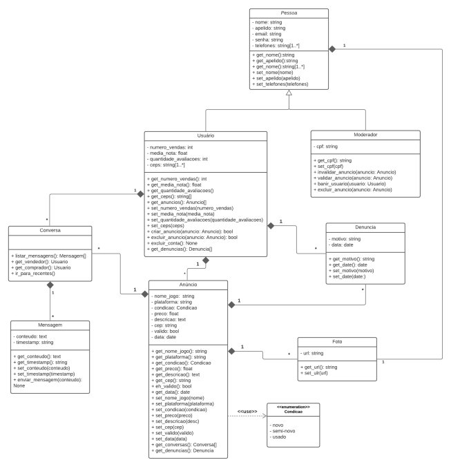

# Diagrama de classes

## Introdução

Os diagramas de classes são um dos tipos de diagramas mais úteis na UML. Nós o utilizaremos no projeto, pois eles mapeiam a estrutura de um sistema de maneira clara, através da modelagem de suas classes, atributos, operações e relacionamentos entre objetos.

## Diagrama

<a href="https://drive.google.com/file/d/1Eo1pcQ4aFlpviyRvsF1M0vWQN2ekdF6b/view?usp=sharing" target="_blank" rel="noopener">Link para a imagem</a>

## Referências

> https://www.lucidchart.com/pages/uml-class-diagram

## Versionamento

| Versão | Data       | Modificação               | Motivo | Autor         |
| ------ | ---------- | ------------------------- | ------ | ------------- |
|  1.0   | 25/02/2021 | Criação do documento de diagrama de classe | Criar um diagrama que indentifique as classes presentes no projeto | Todos os integrantes |