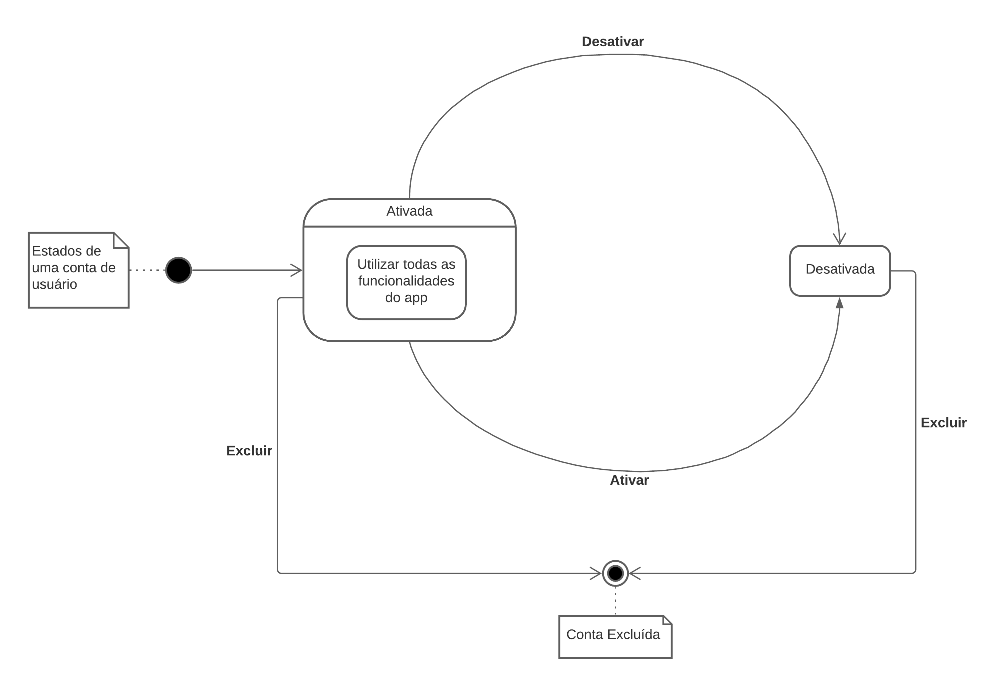

# Metodologias

## Introdução

O digrama de estados é um diagrama comportamental que mostra comportamentos discretos de uma parte de sistema, através de mudanças finitas de estados. Este documento auxiliará na compreensão dos estados dos objetos do sistema e nas mudanças entre eles.

## Diagramas

### Estados de um anúncio

<a href="'https://drive.google.com/file/d/1oURlxCpDiCfDPDax_UFgA8dK676tA2w3/view?usp=sharing" target="_blank" rel="noopener">Link para a imagem</a>

### Estados de uma conta

<a href="https://drive.google.com/file/d/18pgdHR4dGJC1AKnnXJrR8lkabk7T-19T/view?usp=sharing" target="_blank" rel="noopener">Link para a imagem</a>

## Referências

>"State Machine Diagrams". UML-diagrams. Disponível em: https://www.uml-diagrams.org/state-machine-diagrams.html. Acesso em: 04 mar. 2021.

>"O que é um diagrama de máquina de estados?". Lucidchart. Disponível em: https://www.lucidchart.com/pages/pt/o-que-e-diagrama-de-maquina-de-estados-uml. Acesso em: 04 mar. 2021.

## Versionamento
 Versão | Data       | Modificação                    | Motivo | Autor         |
| ------ | ---------- | -------------------------------| ------ | ------------- |
| 1.0 | 04/03/2021 | Criação do documento | Documentar os estados dos objetos do projeto | Igor Paiva e Thiago Lopes |
