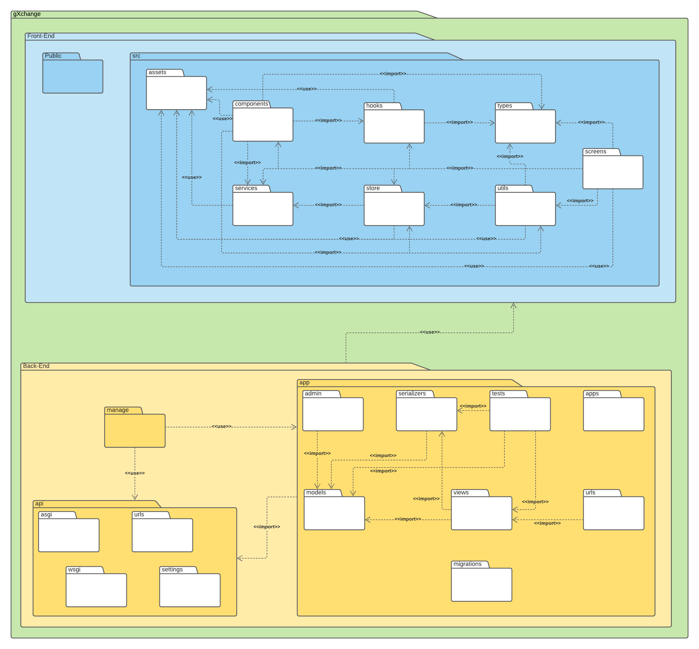

# Metodologias

## Introdução

O diagrama de pacotes mostra a estrutura de um sistema no nível de pacotes. Este documento auxiliará os integrantes da equipe a entender a estrutura e manter um padrão nos pacotes utilizados no projeto.

## Diagrama

<iframe allowfullscreen frameborder="0" style="width:640px; height:480px" src="https://lucid.app/documents/embeddedchart/9dac0fbf-313f-4174-981d-cc73833ac190" id="_WafnIRwPDC~"></iframe>

## Imagem diagrama

<a href="https://drive.google.com/file/d/1nWQfHkQFVMbse3rAtp8eLebTYxH26HsH/view?usp=sharing" target="_blank" rel="noopener">Link para a imagem</a>

## Referências

>"UML Package Diagrams Overview". Disponível em: https://www.uml-diagrams.org/package-diagrams-overview.html. Acesso em: 25 fev. 2021.

## Versionamento
 Versão | Data       | Modificação                    | Motivo | Autor         |
| ------ | ---------- | -------------------------------| ------ | ------------- |
| 1.0 | 24/02/2021 | Criação do documento | Documentar a estrutura dos pacotes que serão utilizados no projeto | Igor Paiva e Rhuan Queiroz |
| 1.0.1 | 25/02/2021 | Correção ortográfica | Para corrigir um erro ortográfico | Rhuan Queiroz |
