# Metodologias

## Introdução

O diagrama de atividades é um diagrama de comportamento UML que mostra o fluxo de controle ou de objeto com ênfase na sequência e condições do fluxo. Essas ações coordenadas pelos modelos de atividade podem ser iniciadas porque outras ações terminaram de executar, porque objetos e dados ficam disponíveis, ou também porque alguns eventos externos ao fluxo ocorrem. Optamos pela utilização desse diagrama pois ele além de ilustrar um processo de negócio ou fluxo de trabalho entre usuário e o sistema, também modela elementos de arquitetura de software, como método, função e operação.

## Diagramas

### Cadastro

#### Imagem do diagrama

<a href="https://drive.google.com/file/d/1bNngyaRaPIq9yKHv14zx5CwV__vJOU8Z/view?usp=sharing" target="_blank" rel="noopener">Link para a imagem</a>

#### Versionamento
 Versão | Data       | Modificação                    | Motivo | Autor         |
| ------ | ---------- | -------------------------------| ------ | ------------- |
| 1.0 | 03/03/2021 | Adição do diagrama de cadastro | Necessidade de representar o sistema de cadasto em um diagrama de atividade | Marcelo Victor e Washington Bispo |

### Login

#### Imagem do diagrama

<a href="https://drive.google.com/file/d/1u0bj9bIStbdFTb9Z4-DUXy2tkEdyV6NW/view?usp=sharing" target="_blank" rel="noopener">Link para a imagem</a>

#### Versionamento
 Versão | Data       | Modificação                    | Motivo | Autor         |
| ------ | ---------- | -------------------------------| ------ | ------------- |
| 1.0 | 03/03/2021 | Adição do diagrama de login | Necessidade de representar o sistema de login em um diagrama de atividade | Marcelo Victor e Washington Bispo |

### Mensagem para o vendedor

#### Imagem do diagrama

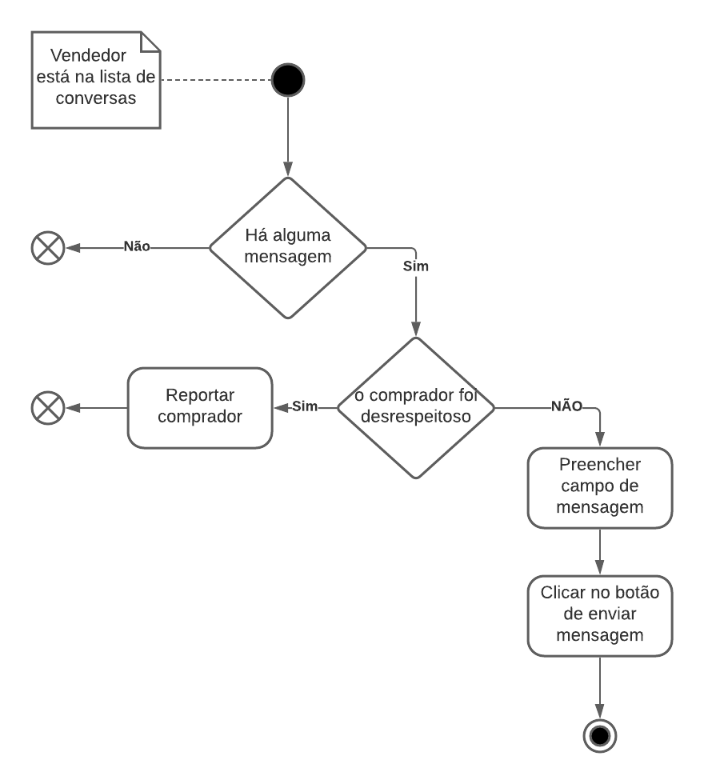

<a href="https://drive.google.com/file/d/1LQfUq2LrjinLC51Cd3SB_9WQHzRoVyiw/view?usp=sharing" target="_blank" rel="noopener">Link para a imagem</a>

#### Versionamento
 Versão | Data       | Modificação                    | Motivo | Autor         |
| ------ | ---------- | -------------------------------| ------ | ------------- |
| 1.0 | 03/03/2021 | Adição do diagrama de mensagem para o vendedor | Necessidade de representar o sistema de mensagem para um vendedor em um diagrama de atividade | Marcelo Victor e Washington Bispo |

### Mensagem para o comprador

#### Imagem do diagrama

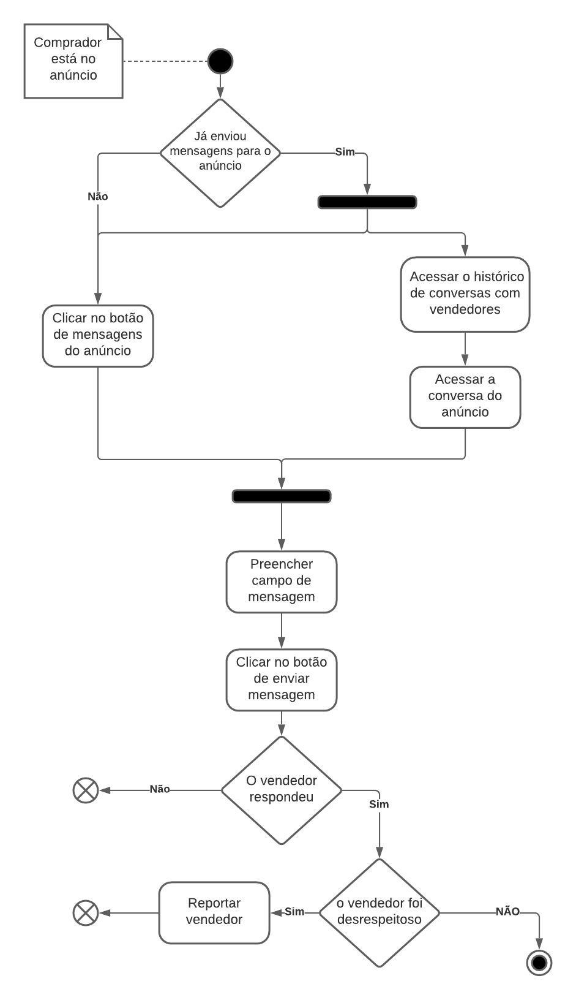

<a href="https://drive.google.com/file/d/1yWHnuG8Rk7L3BAnvoEMsJuwxOfruN8oZ/view?usp=sharing" target="_blank" rel="noopener">Link para a imagem</a>

#### Versionamento
 Versão | Data       | Modificação                    | Motivo | Autor         |
| ------ | ---------- | -------------------------------| ------ | ------------- |
| 1.0 | 03/03/2021 | Adição do diagrama de mensagem para o comprador | Necessidade de representar o sistema de mensagem para um comprador em um diagrama de atividade | Marcelo Victor e Washington Bispo |

### Avaliar usuário

#### Imagem do diagrama

<a href="https://drive.google.com/file/d/1TphZXcGxb1sWWaDUTEJqrzptHiv70tT3/view?usp=sharing" target="_blank" rel="noopener">Link para a imagem</a>

#### Versionamento
 Versão | Data       | Modificação                    | Motivo | Autor         |
| ------ | ---------- | -------------------------------| ------ | ------------- |
| 1.0 | 03/03/2021 | Adição do diagrama de avaliar o usuário | Necessidade de representar o sistema de avaliar o usuário em um diagrama de atividade | Marcelo Victor e Washington Bispo |

### Banir usuário

#### Imagem do diagrama

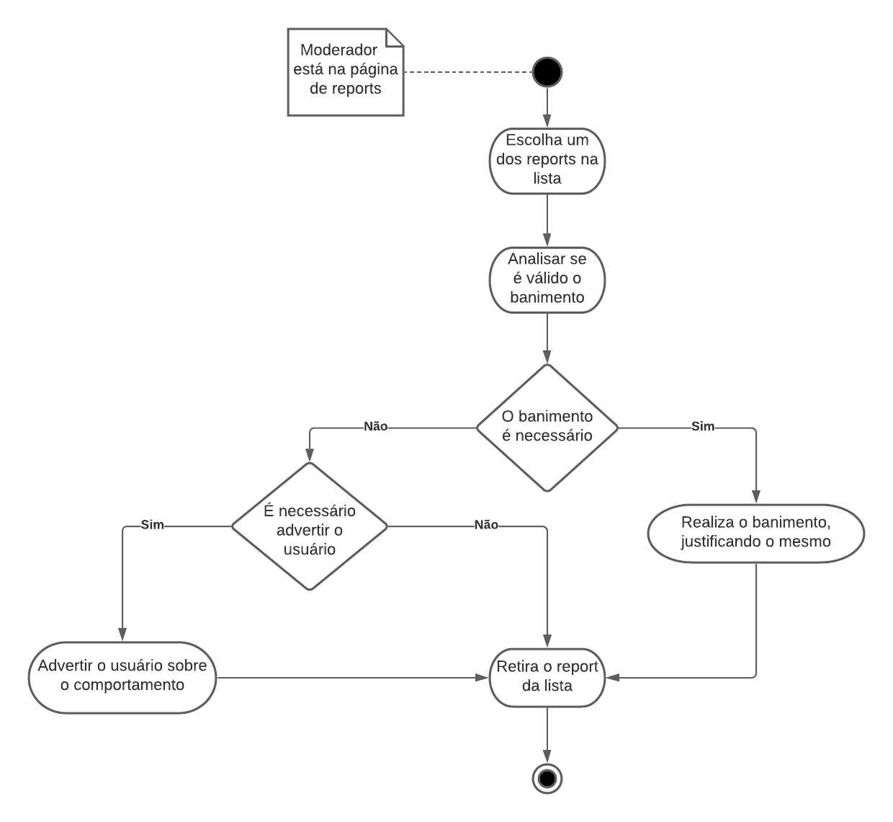

<a href="https://drive.google.com/file/d/1EccWXysRzTMVrbIQkj8fGvqTtNVk52us/view?usp=sharing" target="_blank" rel="noopener">Link para a imagem</a>

#### Versionamento
 Versão | Data       | Modificação                    | Motivo | Autor         |
| ------ | ---------- | -------------------------------| ------ | ------------- |
| 1.0 | 03/03/2021 | Adição do diagrama de avaliar o usuário | Necessidade de representar o sistema de banimento do usuário em um diagrama de atividade | Marcelo Victor e Washington Bispo |

### Reportar anúncio

#### Imagem do diagrama

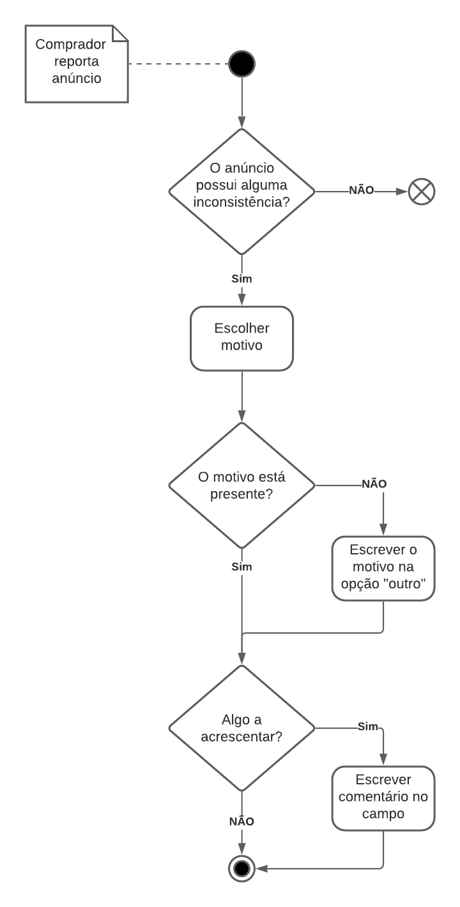

<a href="https://drive.google.com/file/d/1KwFJFLO9h_htUbVmuCdsXirfWejj21Eo/view?usp=sharing" target="_blank" rel="noopener">Link para a imagem</a>

#### Versionamento
 Versão | Data       | Modificação                    | Motivo | Autor         |
| ------ | ---------- | -------------------------------| ------ | ------------- |
| 1.0 | 03/03/2021 | Adição do diagrama de atividade de reportar anúncio, criado no dia 24/02/2021  | Necessidade de representar as atividades tomadas pelo usuário com o intuito de reportar um anúncio | Igor Paiva e Rhuan Queiroz |

### Cadastrar Anúncio

#### Imagem do diagrama

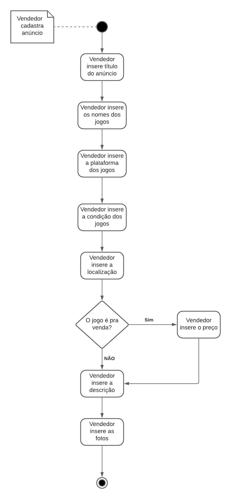

<a href="https://drive.google.com/file/d/1JUlyKtuBETq1SdxLXdNmf88C-QPESqNN/view?usp=sharing" target="_blank" rel="noopener">Link para a imagem</a>

#### Versionamento
 Versão | Data       | Modificação                    | Motivo | Autor         |
| ------ | ---------- | -------------------------------| ------ | ------------- |
| 1.0 | 03/03/2021 | Adição do diagrama de atividade de cadastrar anúncio, criado no dia 24/02/2021  | Necessidade de representar as atividades tomadas pelo usuário com o intuito de cadastrar um anúncio | Igor Paiva e Rhuan Queiroz |

### Alterar Senha

#### Imagem do diagrama

<a href="https://drive.google.com/file/d/19-w_so9imRlyVUkta7DkDLrW15aGF9wa/view?usp=sharing" target="_blank" rel="noopener">Link para a imagem</a>

#### Versionamento
 Versão | Data       | Modificação                    | Motivo | Autor         |
| ------ | ---------- | -------------------------------| ------ | ------------- |
| 1.0 | 03/03/2021 | Adição do diagrama de atividade de alterar senha  | Necessidade de representar as atividades tomadas pelo usuário com o intuito de alterar senha | Thiago Guilherme e Thiago Lopes |

### Desativar Conta

#### Imagem do diagrama

<a href="https://drive.google.com/file/d/15pQF-46pXoyKyEgUS3sTcMOdpfS5W4vR/view?usp=sharing" target="_blank" rel="noopener">Link para a imagem</a>

#### Versionamento
 Versão | Data       | Modificação                    | Motivo | Autor         |
| ------ | ---------- | -------------------------------| ------ | ------------- |
| 1.0 | 03/03/2021 | Adição do diagrama de atividade de desativar conta  | Necessidade de representar as atividades tomadas pelo usuário com o intuito de desativar conta | Thiago Guilherme e Thiago Lopes |

### Editar Perfil

#### Imagem do diagrama

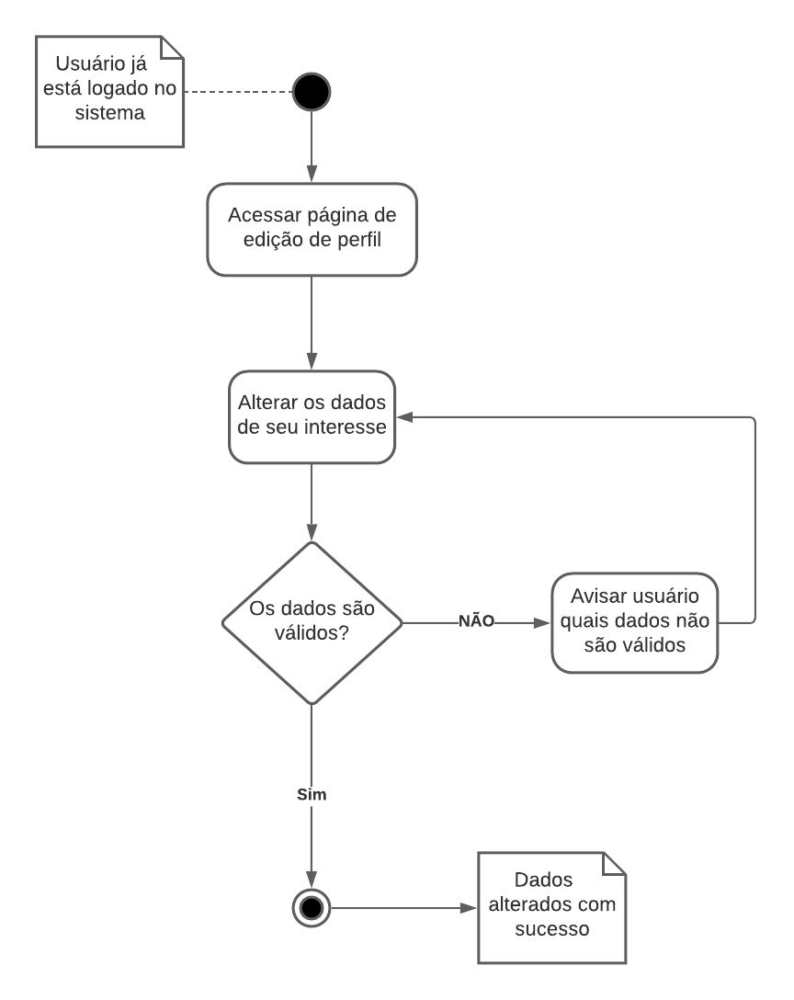

<a href="https://drive.google.com/file/d/13ZobU4LVqJdabI952fX3jfgoz4B5d-Qa/view?usp=sharing" target="_blank" rel="noopener">Link para a imagem</a>

#### Versionamento
 Versão | Data       | Modificação                    | Motivo | Autor         |
| ------ | ---------- | -------------------------------| ------ | ------------- |
| 1.0 | 03/03/2021 | Adição do diagrama de atividade de editar perfil  | Necessidade de representar as atividades tomadas pelo usuário com o intuito de editar perfil | Thiago Guilherme e Thiago Lopes |

### Excluir Conta

#### Imagem do diagrama

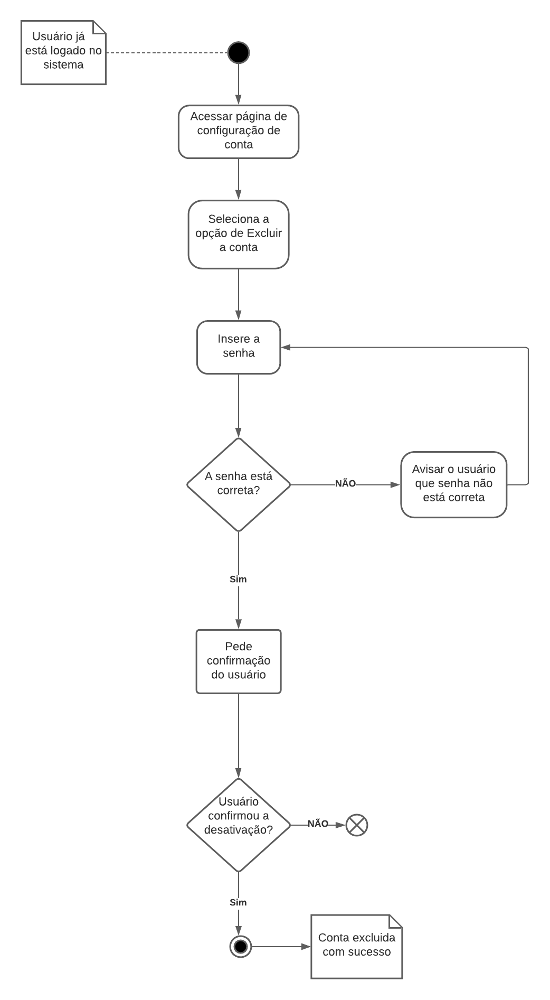

<a href="https://drive.google.com/file/d/1TvxyQ2PjRgN5rS5OqWprksxPXhRtoXCl/view?usp=sharing" target="_blank" rel="noopener">Link para a imagem</a>

#### Versionamento
 Versão | Data       | Modificação                    | Motivo | Autor         |
| ------ | ---------- | -------------------------------| ------ | ------------- |
| 1.0 | 03/03/2021 | Adição do diagrama de atividade de excluir conta  | Necessidade de representar as atividades tomadas pelo usuário com o intuito de excluir conta | Thiago Guilherme e Thiago Lopes |

### Personalizar Feed

#### Imagem do diagrama

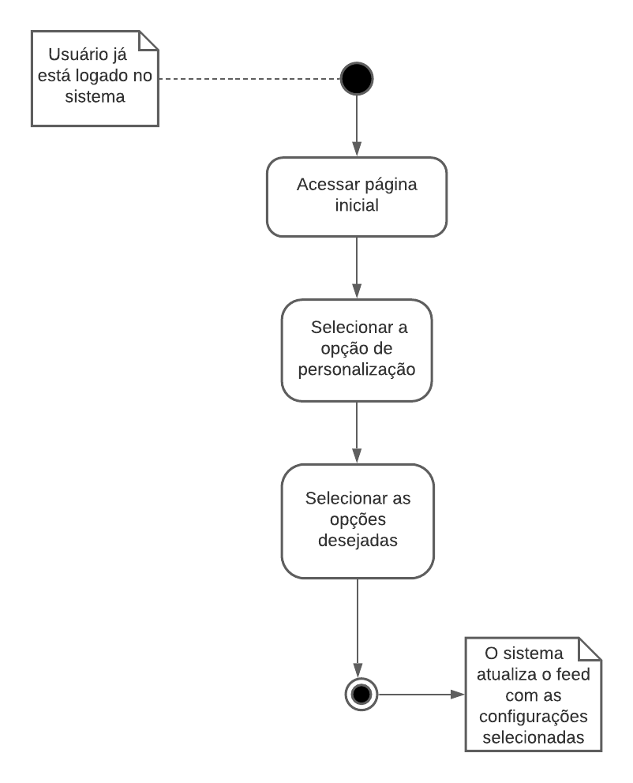

<a href="https://drive.google.com/file/d/1WrZCUBI8Qerx0OvbEgAIzMbWNUabuRu9/view?usp=sharing" target="_blank" rel="noopener">Link para a imagem</a>

#### Versionamento
 Versão | Data       | Modificação                    | Motivo | Autor         |
| ------ | ---------- | -------------------------------| ------ | ------------- |
| 1.0 | 03/03/2021 | Adição do diagrama de atividade de personalizar feed  | Necessidade de representar as atividades tomadas pelo usuário com o intuito de personalizar feed | Thiago Guilherme e Thiago Lopes |

### Reportar Usuário

#### Imagem do diagrama

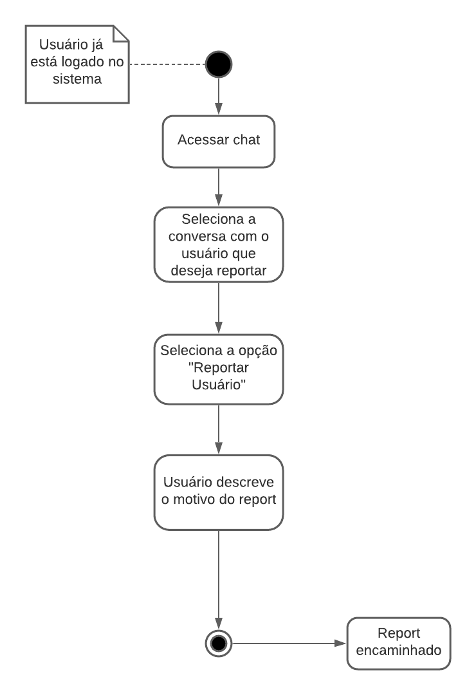

<a href="https://drive.google.com/file/d/19FkBXFRJd5_KLSn3TmTahgnvbiUYq4dK/view?usp=sharing" target="_blank" rel="noopener">Link para a imagem</a>

#### Versionamento
 Versão | Data       | Modificação                    | Motivo | Autor         |
| ------ | ---------- | -------------------------------| ------ | ------------- |
| 1.0 | 03/03/2021 | Adição do diagrama de atividade de reportar usuário | Necessidade de representar as atividades tomadas pelo usuário com o intuito de reportar usuário | Thiago Guilherme e Thiago Lopes |

### Visualizar anúncios

#### Imagem do diagrama

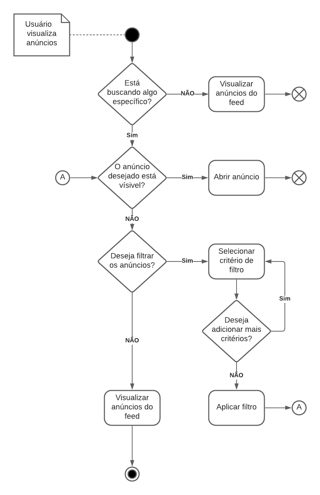

<a href="https://drive.google.com/file/d/1N1LvaC9gm7eY0iZrmGGA8RW27qMho90g/view?usp=sharing" target="_blank" rel="noopener">Link para a imagem</a>

#### Versionamento
 Versão | Data       | Modificação                    | Motivo | Autor         |
| ------ | ---------- | -------------------------------| ------ | ------------- |
| 1.0 | 03/03/2021 | Adição do diagrama de atividade de visualizar anúncios | Necessidade de representar as atividades tomadas pelo usuário com o intuito de visualizar anúncios | Igor Paiva e Rhuan Queiroz |

### Editar anúncio

#### Imagem do diagrama

<a href="https://drive.google.com/file/d/1tMjmTIP0ddVHrewiPhaiLQwph8y8mHFF/view?usp=sharing" target="_blank" rel="noopener">Link para a imagem</a>

#### Versionamento
 Versão | Data       | Modificação                    | Motivo | Autor         |
| ------ | ---------- | -------------------------------| ------ | ------------- |
| 1.0 | 03/03/2021 | Adição do diagrama de atividade de editar anúncio | Necessidade de representar as atividades tomadas pelo usuário com o intuito de editar anúncio | Igor Paiva e Rhuan Queiroz |

### Invalidar anúncio

#### Imagem do diagrama

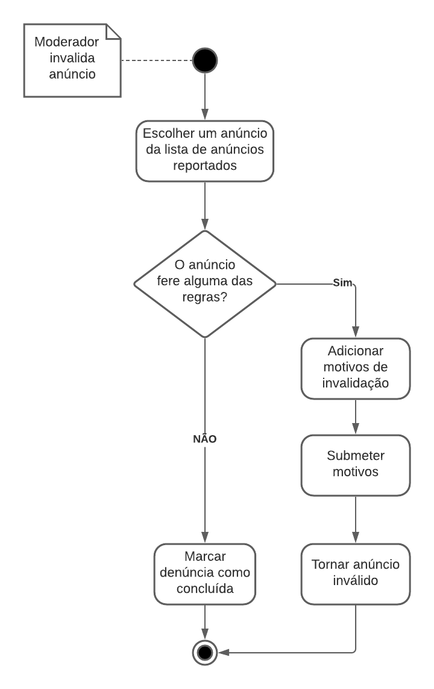

<a href="https://drive.google.com/file/d/1Od8Mr-_RQ7TG8YYxR7SxLqMqWdaFDaCL/view?usp=sharing" target="_blank" rel="noopener">Link para a imagem</a>

#### Versionamento
 Versão | Data       | Modificação                    | Motivo | Autor         |
| ------ | ---------- | -------------------------------| ------ | ------------- |
| 1.0 | 03/03/2021 | Adição do diagrama de atividade de invalidar anúncio | Necessidade de representar as atividades tomadas pelo usuário com o intuito de invalidar anúncio | Igor Paiva e Rhuan Queiroz |

## Referências

>"O que é diagrama de atividades UML?". Lucidchart. Disponível em: https://www.lucidchart.com/pages/pt/o-que-e-diagrama-de-atividades-uml. Acesso em: 1º mar. 2021.

>"Activity Diagrams". UML-Diagrams. Disponível em: https://www.uml-diagrams.org/activity-diagrams.html. Acesso em: 1º mar. 2021.

## Versionamento
 Versão | Data       | Modificação                    | Motivo | Autor         |
| ------ | ---------- | -------------------------------| ------ | ------------- |
| 1.0 | 01/03/2021 | Criação do documento base para os diagramas de atividade | Prover a estrutura base para a inserção dos diagramas | Thiago Lopes e Rhuan Queiroz |
