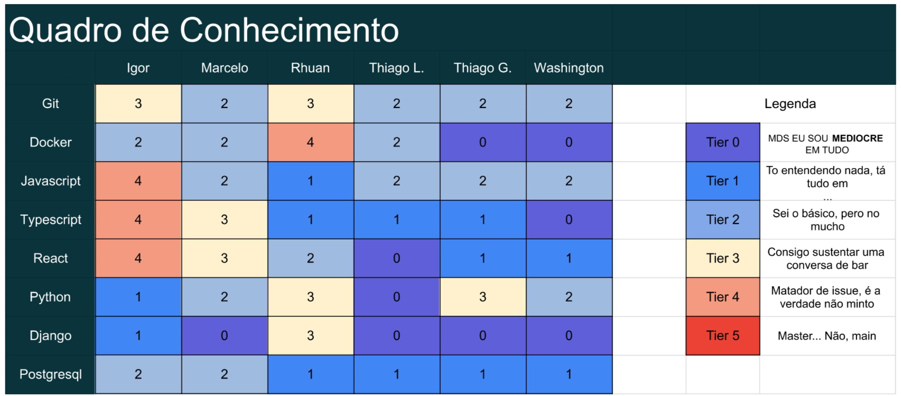

# Planejamento da Sprint 1

## Palavras-chave

&emsp;[Vendedor](../../../../desenho/base/1.1/lexico/#l7-usuario), [Usuário](../../../../desenho/base/1.1/lexico/#l7-usuario), [Anúncio](../../../../desenho/base/1.1/lexico/#l1-anuncio)

## Quadro de conhecimentos

## Como o trabalho escolhido será realizado?

Todo o time irá participar da elaboração do incremento selecionado.

## Backlog da sprint

### US03

Eu, como um usuário, desejo realizar cadastro utilizando email para que eu consiga me cadastrar e utilizar o sistema.

Prioridade: Muito alta

Rastreabilidade: RF-03

Critérios de aceitação:

- A conta está sendo criada corretamente?
- Todos os dados necessários estão sendo coletados?
- A senha da conta possui mais que 8 caracteres?
- A senha contém ao menos uma letra maiúscula, um número e um caractere especial?
- O email é válido, ou seja, possui alias@domain?

### US04

Eu, como um usuário, desejo concordar com os termos de consentimento ao realizar meu cadastro para que eu consiga estar ciente de como o sistema lidará com meus dados sensíveis.

Prioridade: Muito alta

Rastreabilidade: RF-24

Critérios de aceitação:

- O termo de consentimento é exibido ao usuário durante o cadastro?
- O termo lista como o sistema usará os dados do usuário?
- O termo lista como o sistema guardará os dados do usuário?
- Só é possível continuar o cadastro se o termo for aceito?

### US05

Eu, como um usuário, desejo que meus dados (nome, apelido (nome de usuário), email e senha) sejam salvos para que eu consiga utilizar o sistema de maneira segura e eficaz, e possa ser identificado por outros usuários.

Prioridade: Muito alta

Rastreabilidade: RF-25

Critérios de aceitação:

- Os dados estão salvos no sistema corretamente?
- Os dados utilizam os campos adequados, de modo a otimizar o espaço de armazenamento?
- A senha é salva criptografada?

### US10

Eu, como um vendedor, desejo que meus anúncios sejam salvos com: nome do(s) jogo(s), plataforma, condição, foto(s), minhas informações de contato, localização, preço e descrição para que eu consiga descrever bem os jogos que desejo trocar e/ou vender.

Prioridade: Muito alta

Rastreabilidade: RF-12

Critérios de aceitação:

- Os dados estão salvos no sistema corretamente?
- Os dados utilizam os campos adequados, de modo a otimizar o espaço de armazenamento?
- As fotos são enviadas corretamente?
- Possui pelo menos uma foto?

## Referências

> SCHWABER, Ken; SUTHERLAND, Jeff. “Guia do Scrum - Um guia definitivo para o Scrum: As regras do jogo”. Scrum.Org and ScrumInc, 2014.
