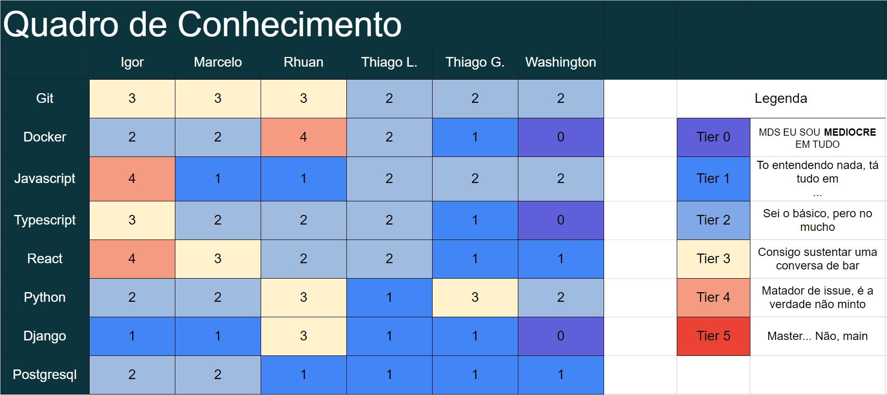

# Revisão da sprint 3

## Palavras-chave

&emsp;Lista de palavras chaves com link

## Quadro de conhecimentos

<a href="https://drive.google.com/file/d/1uydCa6GdV0EkR9Cfc88E3BOEN69kM0zj/view?usp=sharing" target="_blank" rel="noopener noreferrer">Link para a imagem</a>

## O que ficou pronto nessa sprint? (PO)

Edição de anúncio US12, cadastro de anúncio US09.

## Aspectos da sprint

### Aspectos positivos

- Cada dia mais perto da entrega do projeto (ou não)
- O esqueleto do feed ficou pronto, o card ficou bala, tiramos a foto do Sherlock Holmes
- O update da offer tá lindíssissimo.
- Junin subiu um Docker pela primeira vez \*-\* (DevOps está orgulhoso)

### Problemas / soluções

- Serializer roubando os base64
  - Tirar da serializer e fazer isso na mão
- Muito tempo para resolver o problema de cadastro de anúncio, o que atrasou a sprint como um todo.
  - Fazer as coisas na View, serve de lição
- Problemas quanto a localização do anúncio
  - Usar API do correios

## O produto irá ser finalizado no prazo? (PO)

Possivelmente.

## O que vem a seguir?

- O tempo. O tempo de Deus tem seus mistérios. Amém!

## Mudanças no backlog de produto

- 2 User Stories, um número

## Referências

> SCHWABER, Ken; SUTHERLAND, Jeff. “Guia do Scrum - Um guia definitivo para o Scrum: As regras do jogo”. Scrum.Org and ScrumInc, 2014.
