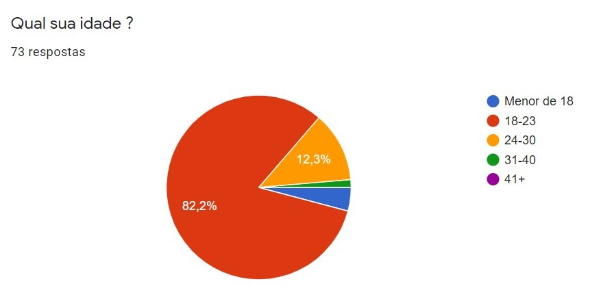
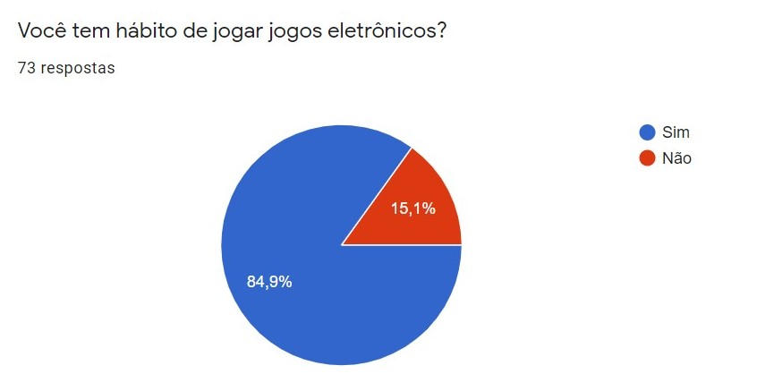
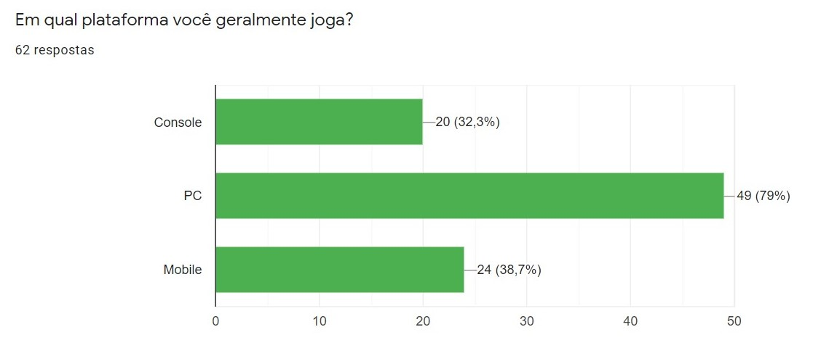
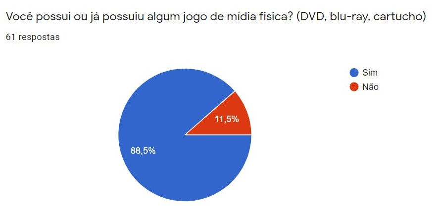
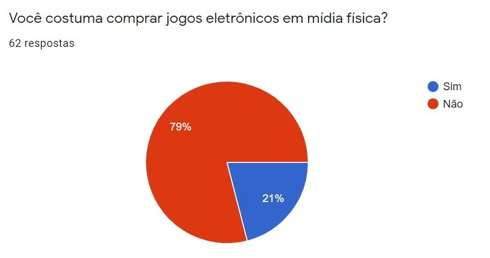
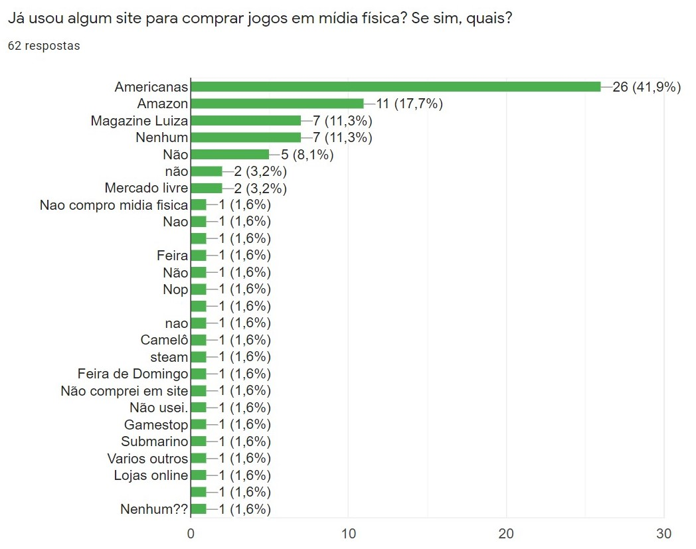
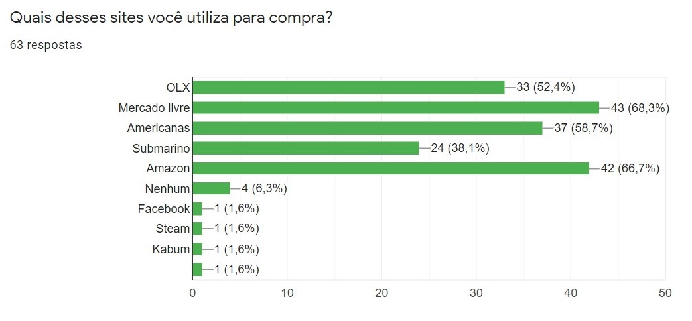

# Questionário

## Introdução

O método de Questionário consiste na criação de um conjunto de perguntas, o principal motivo de utilizarmos a técnica de questionário foi devido ao seu baixo custo atrelado à uma quantidade de respostas razoável, além de tornar possível a obtenção de respostas de diversos possíveis usuários em posições geográficas diferentes e a partir disso, elicitar os requisitos de acordo com suas respostas.

## Resultado do questionário

Essas foram as respostas obtidas após no final.

### Questão 1

<a href="https://drive.google.com/file/d/10PXo164yJR6Ju0vsGu_lZ7jSbsNqvhUV/view?usp=sharing" target="_blank" rel="noopener">Link para a imagem</a>

### Questão 2

<a href="https://drive.google.com/file/d/1NSKtHTT6gvwLhV2qT4hRGwhH4ZCqclQi/view?usp=sharing" target="_blank" rel="noopener">Link para a imagem</a>

### Questão 3

<a href="https://drive.google.com/file/d/1xGOJs6nzGhWBjZiL-VhB5TRWWxQvGwHo/view?usp=sharing" target="_blank" rel="noopener">Link para a imagem</a>

### Questão 4

<a href="https://drive.google.com/file/d/1ZQx3xCoumM9Kh7mPbVD5lqswMB1rpIA8/view?usp=sharing" target="_blank" rel="noopener">Link para a imagem</a>

### Questão 5

<a href="https://drive.google.com/file/d/1umaKOpwXZaLu__pib9rkXohwPerTZlIw/view?usp=sharing" target="_blank" rel="noopener">Link para a imagem</a>

### Questão 6

<a href="https://drive.google.com/file/d/1LngJqoq9ANLGrvjRxPIYruT2rEqPiGg9/view?usp=sharing" target="_blank" rel="noopener">Link para a imagem</a>

### Questão 7

<a href="https://drive.google.com/file/d/1VlAeTNPusZeXFxhqVp06Ka-Vkh1xqC3A/view?usp=sharing" target="_blank" rel="noopener">Link para a imagem</a>

### Questão 8

<a href="https://drive.google.com/file/d/1OYmN-eKL7jcVLGr3Rh4cVVbTO7t9yGd6/view?usp=sharing" target="_blank" rel="noopener">Link para a imagem</a>

### Questão 9

<a href="https://drive.google.com/file/d/1n4aG4S8b6aOcE5jHYXy6Xd9N4UhdsH1c/view?usp=sharing" target="_blank" rel="noopener">Link para a imagem</a>

### Questão 10

<a href="https://drive.google.com/file/d/1VQKaOrnQ_8_mfEmX1iIjuiaWpzGbIqul/view?usp=sharing" target="_blank" rel="noopener">Link para a imagem</a>

### Questão 11

<a href="https://drive.google.com/file/d/1Luf8l_8bemP37CHsJjAICVxxyDmliicu/view?usp=sharing" target="_blank" rel="noopener">Link para a imagem</a>

### Questão 12

<a href="https://drive.google.com/file/d/1KHe1tuSKvOOhacjo_1Wg04jFOzustIux/view?usp=sharing" target="_blank" rel="noopener">Link para a imagem</a>

### Questão 13

<a href="https://drive.google.com/file/d/1LmIWFAVFBF45tMHt_1Nn1blwrdAMUC6B/view?usp=sharing" target="_blank" rel="noopener">Link para a imagem</a>

## Requisitos Elicitados

### Funcionais

| Número | Requisito |
|:-:|-|
| 1 | O [usuário](/lexico/#l7-usuario) deve ser capaz de visualizar as fotos de um [anúncio](/lexico/#l1-anuncio) |
| 2 | O [usuário](/lexico/#l7-usuario) deve ser capaz de enviar mensagens para outros [usuários](/lexico/#l7-usuario) |
| 3 | O [usuário](/lexico/#l7-usuario) deve ser capaz de acessar uma página de ajuda e suporte |
| 4 | O [usuário](/lexico/#l7-usuario) deve ser capaz de [avaliar](/lexico/#l5-avaliar) outros [usuários](/lexico/#l7-usuario) |
| 5 | O [usuário](/lexico/#l7-usuario) deve ser capaz de visualizar o perfil de outros [usuários](/lexico/#l7-usuario) |
| 6 | O [usuário](/lexico/#l7-usuario) deve ser capaz de visualizar o feed de [anúncios](/lexico/#l1-anuncio) |
| 7 | O [usuário](/lexico/#l7-usuario) deve ser capaz de buscar por um [anúncio](/lexico/#l1-anuncio) |
| 8 | O [usuário](/lexico/#l7-usuario) deve ser capaz de realizar seu cadastro por email |
| 9 | O [usuário](/lexico/#l7-usuario) deve ser capaz de realizar seu cadastro pelo facebook |
| 10 | O [usuário](/lexico/#l7-usuario) deve ser capaz de realizar seu cadastro pelo google |
| 11 | O [usuário](/lexico/#l7-usuario) deve ser capaz de visualizar as [avaliações](/lexico/#l5-avaliar) de outros [usuários](/lexico/#l7-usuario) |
| 12 | O [usuário](/lexico/#l7-usuario) deve ser capaz de visualizar os dados (nome do [jogo](/lexico/#l4-jogo), tempo de uso, plataforma, localização, preço) de um [anúncio](/lexico/#l1-anuncio) |

### Não Funcionais

| Número | Requisito |
|:-:|-|
| 1 | O sistema deve manter os dados sensíveis do [usuário](/lexico/#l7-usuario) encriptados |
| 2 | O sistema deve ser capaz de responder as requisições do [usuário](/lexico/#l7-usuario) rapidamente |
| 3 | O sistema deve ser confiável [**a ser decidido**](/requisitos/padroes/#a-ser-decidido) |
| 4 | O sistema deve ser de fácil aprendizado [**a ser decidido**](/requisitos/padroes/#a-ser-decidido) |
| 5 | O sistema deve dispor os [anúncios](/lexico/#l1-anuncio) de maneira organizada [**a ser decidido**](/requisitos/padroes/#a-ser-decidido) |

## Referências

> WIEGERS, Karl; BEATTY, Joy. "Software Requirements". Microsoft Press, 2013.

> VAZQUEZ, Carlos; SIVÕES, Guilherme. "Engenharia de Requisitos". Brasport Livros e Multimídia Ltda, 2016.

## Versionamento

| Versão | Data       | Modificação                    | Motivo | Autor         |
| ------ | ---------- | -------------------------------| ------ | ------------- |
| 1.0 | 17/02/2021 | Criação do documento | Relatar os resultados obtidos com o questionário | Rhuan Queiroz, Thiago Guilherme e Washington Bispo |
