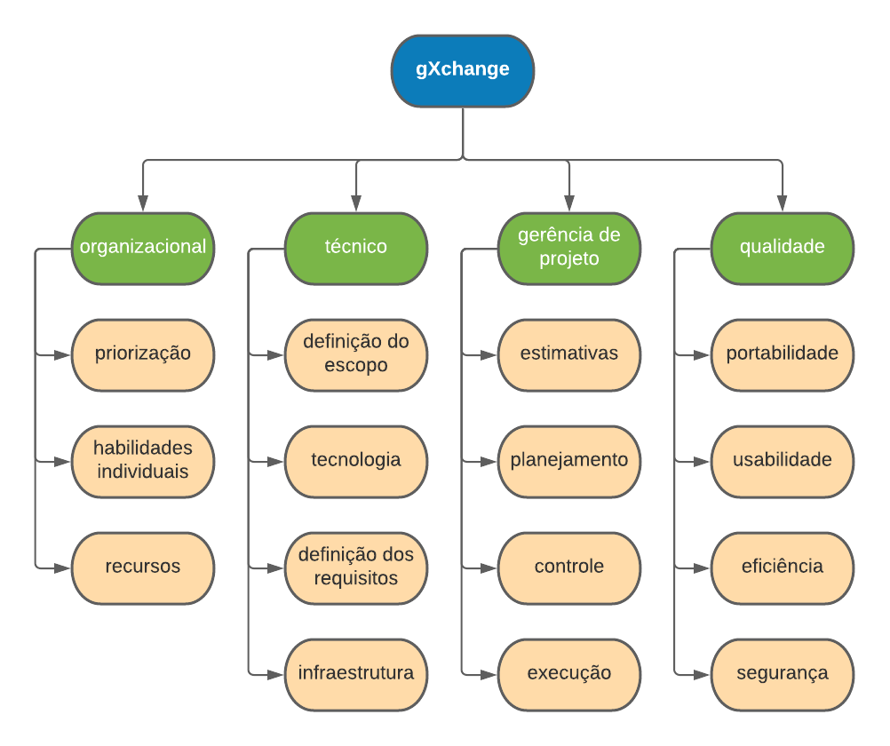

# Análise de riscos

## Introdução

O planejamento da gerência de risco é o processo de definir como conduzir as atividades de gerência de risco para um projeto.

## Estrutura analítica de Riscos

### Organizacional

- Priorização: são riscos relacionados a erros de priorização, que geram impasses relacionados a entregas.

- Habilidades individuais: São riscos relacionadaos as habilidades dos integrantes da equipe, tanto *hard-skills* quanto *soft-skills*.

- Recursos: são riscos relacionados a recursos de tempo e dinheiro.

### Técnico

- Definição do escopo: são riscos relacionados ao escopo do produto e mal defini-lo acarreta problemas nas entregas.

- Tecnologia: são riscos relacionados às tecnologias envolvidas no projeto.

- Definição dos requisitos: são riscos relacionados a especificação e escrita dos requisitos.

- Infraestrutura: são riscos relacionados a infraestrura para o desenvolvimento do projeto. 

### Gerência de projeto

- Estimativas: são relacionados a estimativa dos prazos de tarefas e podem gerar impasses na entrega.

- Planejamento: são riscos relacionados ao planejamento do projeto.

- Controle: são riscos relacionados ao controle de riscos.

- Execução: são riscos relacionados a como as tarefas e o planejamento será executado.

### Qualidade

- Portabilidade: são riscos relacionados sobre a acessibilidade do projeto em diversos dispositivos com acesso a internet.

- Usabilidade: são riscos relacionados a facilidade e intuitividade da interface do projeto.

- Eficiência: são os riscos relacionados ao produto administrar melhor os recursos, impacta diretamente no desempenho.

- Segurança: são riscos relacionados a segurança e preservação de dados dos usuários do sistema.

## Análise Quantitativa dos riscos

### Probabilidade de riscos e impactos

Essas escalas podem ser usadas para avaliar tanto ameaças quanto oportunidades, interpretando as definições de impacto como negativas para as ameaças, e positivas para as oportunidades.

Definimos a probabilidade como sendo a chance de uma escala ocorrer. Também definimos a unidade de tempo baseada em sprints de 7 dias.

| Escala | Probabilidade |
|:-:|:-:|
| Muito Alta | 61-100% |
| Alta | 31-60% |
| Média | 16-30% |
| Baixa | 6-15% |
| Muito Baixa | <5% |

| Escala | Impacto | Tempo | Descrição |
|:-:|:-:|:-:|--|
| Muito baixo | <5% | 1 dia | Impacto pequeno em funções secundárias |
| Baixo | 6-15% | 2-4 dias | Impacto pequeno nas funcionalidades gerais |
| Médio | 16-30% | 1 sprint | Algum impacto nas principais funcionalidades |
| Alto | 31-50% | 2 sprints | Impacto significante nas funcionalidade gerais |
| Muito Alto | 51-80% | 4 sprints | Impacto extremamente significante nas funcionalidades | gerais |

### Matriz de probabilidade e impacto - Prioridade

<iframe height="380px" width="100%" src="https://docs.google.com/spreadsheets/d/e/2PACX-1vSd_dZ4ZoB35vzz9yXwua2z-2ZxH5sM7Y2SW9M4AG1ghp18D1eRPmBi1BAcox2OYrTksnk2Lt-tw7gH/pubhtml?gid=0&amp;single=true&amp;widget=true&amp;headers=false"></iframe>

[Link para a planilha](https://docs.google.com/spreadsheets/d/1EpUkZ90QRISpWAHJeTkk2KQbCKVyE606x8nKwAPlMzE/edit?usp=sharing)

### Matrizes de impacto

#### Organizacional

|Risco| Impacto | Probabilidade | Prevenção | Resposta | Prioridade |
|:-:|:-:|:-:|:-:|:-:|:-:|
| Priorização das atividades | Muito Alto | Muita Baixa | Planejamento das atividades | Deixar uma tarefa para depois | 0,04 |
| Falta de afinidade com o time | Alto | Muita Baixa | Propor dinâmicas entre o grupo, interações fora da disciplina | Realizar atividade de reaproximação com os integrantes | 0,025 |
| Falta de disponibilidade de tempo | Muito Alto | Muito Alta | Administrar melhor as tarefas, adequar a carga horária em relação a outras disciplinas | Prioriza a tarefa em detrimento a outras coisas | 0,32 |
| Falta de habilidade individual ou afinidade com alguma tecnologia | Alto | Média | Estudar as tecnologias, definir os pareamentos de forma a melhorar o conhecimento e a produtividade | Alocar a tarefa para algum integrante com maior afinidade | 0,075 |

#### Técnico

|Risco| Impacto | Probabilidade | Prevenção | Resposta | Prioridade |
|:-:|:-:|:-:|:-:|:-:|:-:|
| Definição de escopo além da disciplina | Muito Alto | Baixa | Usar técnicas mais robustas de priorização, seguir o escopo proposto para a disciplina | Avalia o custo da tarefa e prioriza dentro das limitações do projeto | 0,08 |
| Tecnologia não prover suporte para determinada funcionalidade | Alto | Muito Baixa | Definir melhor o escopo e a tecnologia a ser utilizada | Propor uma solução viável em relação aos custos, caso não seja possível considere priorizar outras tarefas | 0,025 |
| Requisitos estarem mal definidos e escritos | Alto | Baixa | Definir um padrão de escrita para os requisitos, desconsiderar requisitos mal escritos | Reescrever o requisito de maneira a obedecer o padrão proposto | 0,05 |
| Não encontrar um serviço de *deploy* que suporte a aplicação | Muito Alto | Muito Baixa | Estudar os serviços disponíveis, pensar nas tecnologias utilizadas e levar em conta a quantidade de usuários | Troca o serviço de *deploy* | 0,04 |
| Falta de recurso computacional para um integrante | Médio | Muito Baixa | Pensar nas tecnologias utilizadas e poupar recurso quando possível | Realoca a tarefa para outro integrante | 0,015 |

#### Gerência de projeto

|Risco| Impacto | Probabilidade | Prevenção | Resposta | Prioridade |
|:-:|:-:|:-:|:-:|:-:|:-:|
| Estimar errado o tempo a ser gasto | Muito Alto | Médio | Avaliar complexidade da tarefa, conversar com os outros integrantes e adequar com o tempo disponível | Alocar mais tempo para a realização da tarefa | 0,12 |
| Esquecer de planejar alguma tarefa | Médio | Baixa | Seguir o escopo da disciplina e as entregas a serem realizadas | Revisa o planejamento e planeja a tarefa | 0,03 |
| Quantificar os riscos de forma errada ou esquecer algum risco | Médio | Baixa | Manter o documento de análise de riscos atualizado | Julga o impacto, atualiza o risco e tentar propor uma remediação | 0,03 |
| Escolher um caminho ruim ou custoso para realizar uma tarefa | Alto | Muito Baixa | Conversar com a equipe sobre a tarefa, avaliar o que há de ser feito e estudar as abordagens possíveis | Reavalia e revisa a tarefa | 0,04 |

#### Qualidade

|Risco| Impacto | Probabilidade | Prevenção | Resposta | Prioridade |
|:-:|:-:|:-:|:-:|:-:|:-:|
| Dispositivo não fornecer suporte adequado para determinada função, levando em conta as diferenças entre os navegadores | Alto | Alta | Avaliar os suportes individuais dos navegadores | Contornar o uso da função com outra abordagem portável | 0,15 |
| Não ter definido uma documentação de interface bem definida | Alto | Média | Fazer a documentação | Tentar cobrir a documentação necessária para o problema específico | 0,075 |
| O produto usar recurso demasiadamente | Alto | Muito Baixa | Avaliar as tecnologias a serem usadas, seguir padrões da comunidade | Reavaliar e refatorar a funcionalidade problemática | 0,025 |
| Os dados do usuário serem expostos | Muito Alto | Média | Usar criptografia, usar tokens no *deploy* e padrões de segurança | Pensar em abordagens mais corretas para resolver o problema | 0,12 |

## Referências

> "Project Management Body of Knowledge 6th edition". Project Management Institute, 2017.

## Versionamento

| Versão | Data       | Modificação          | Motivo | Autor         |
| ------ | ---------- | -------------------- | ------ | ------------- |
|  [1.0](/versoes/riscos/1.0/)   | 14/02/2021 | Criação do documento | Fazer uma análise de risco do projeto | Igor Paiva, Rhuan Queiroz, Marcelo Victor, Thiago Lopes e Washington Bispo |
|  2.0   | 16/02/2021 | Adição das matrizes de impacto | Completar o documento de análise de riscos | Todos os integrantes |
