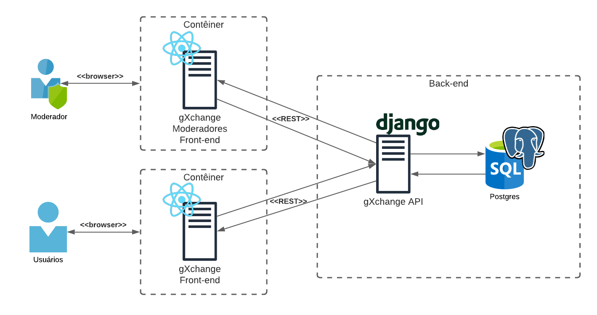
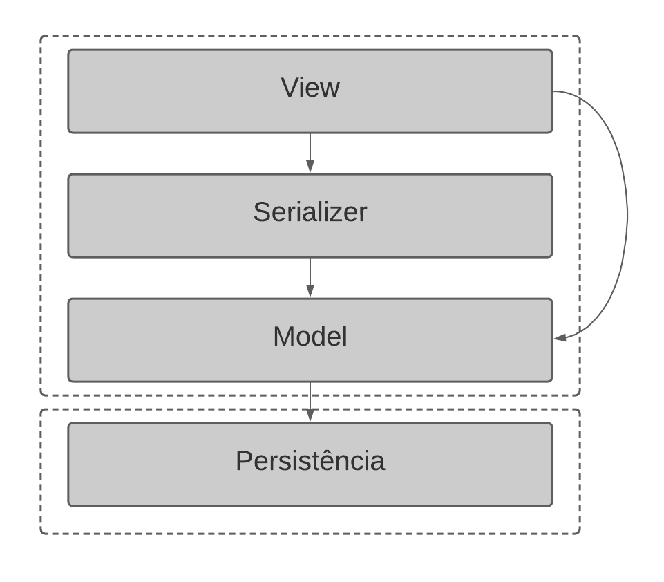

# Documento de Arquitetura de Software

## 1. Introdução

### 1.1 Propósito

Este documento fornece uma visão arquitetural abrangente do sistema, usando diversas visões de arquitetura para representar diferentes aspectos do sistema. Ele pretende capturar e transmitir as decisões arquiteturas significativas que foram tomadas em relação ao sistema.

### 1.2 Escopo

Este documento se aplica a arquitetura do <strong>gXchange</strong> e todos os seus componentes, módulos, sistemas e subsistemas, além dos repositórios de implementação.

### 1.3 Definições Acrônimos e Abreviações

| Acrônimo | Forma extendida |
| ------ | --------- |
| DRF | Django Rest-Framework |

Os léxicos aplicáveis no contexto do gXchange podem ser consultados no documento de <a href="../../../desenho/base/1.1/lexico">léxicos</a>

Requisitos, histórias de usuário, épicos e features seguem o padrão já adotado no <a href="../../../desenho/modelagem/iniciativa/especificacao_suplementar">SRS</a> que referencia a seção de padrões da Wiki. Esses que serão referenciados pelo padrão identificador seguido pelo seu título.

### 1.4 Referências

> Documento de arquitetura de Software. UFPE. Disponível em: https://www.cin.ufpe.br/~gta/rup-vc/core.informal_resources/guidances/examples/resources/ex_sad.htm. Acesso em: 24/04/2021

> Documento de arquitetura de Software. UFPE. Disponível em: https://www.cin.ufpe.br/~gta/rup-vc/extend.formal_resources/guidances/examples/resources/sadoc_v1.htm. Acesso em: 24/04/2021

> Artefatos do gXchange. Disponível em: https://github.com/UnBArqDsw2020-2/2020.2_G7_gXchange_DOCS.

> Visões Arquiteturais. Disponível em: https://www.dimap.ufrn.br/~thais/Arquitetura20081/Visoes4+1eDocumentacao.pdf. Acesso em: 27/04/2021

> Kruchten’s 4 + 1 views of Software Design. Disponível em: https://medium.com/the-mighty-programmer/kruchtens-views-of-software-design-e9088398c592. Acesso em: 27/04/2021

### 1.5 Visão Geral

Este documento é divido em seções, cada qual com seu próposito:

| Tópico | Descrição |
| ------ | --------- |
| [Representação Arquitetural](#2-representacao-arquitetural) | Contém por meio de diagramas o padrão arquitetural do sistema |
| [Objetivos Arquiteturais e Restrições](#3-objetivos-arquiteturais-e-restricoes) | Descreve os requisitos do software e objetivos que impactam na arquitetura, além das restrições |
| [Visualização de Casos de Uso](#4-visualizacao-de-casos-de-uso) | Lista os casos de uso e cenários do software |
| [Visão Lógica](#5-visao-logica) | Descreve as partes importantes do domínio modelo, assim como sua decomposição em subsistemas, pacotes, classes e classes de utilidade |
| [Visão de Processo](#6-visao-de-processo) | Descreve a decomposição do sistema em processos |
| [Visão de Implantação](#7-visao-de-implantacao) | Descreve as configurações físicas em que o software roda e é implantado, assim como, o processo de implantação adotado |
| [Visão de Implementação](#8-visao-de-implementacao) | Descreve de forma geral a estrutura de implementação do software, a decomposição do software em camadas e subsistemas |
| [Visão de Dados](#9-visao-de-dados) | Descreve como a camada de persistência vai persistir os dados, e como os dados são modelados  |
| [Tamanho e Perfomance](#10-tamanho-e-performance) | Descreve o tamanho do software e seu impacto em relação a arquitetura, assim como os objetivos de performance |
| [Qualidade](#11-qualidade) | Descreve como a arquitetura impacta e contribuí para os atributos de qualidade |

## 2. Representação Arquitetural

A solução arquitetural definida para o gXchange pode ser visualizada, em sua forma com granularidade maior, abaixo:

<a href="https://drive.google.com/file/d/1raywRBZc67k7WeM89ZlA2T3kvpV1XzzX/view?usp=sharing" target="_blank" rel="noopener noreferrer">Link para a imagem</a>

Consiste numa arquitetura que obedece o modelo Cliente-Servidor, em que no caso os dois Clientes são os chamados Front-end. Já o servidor, é a gXchange-API, também chamada de Back-end;

### 2.1 Back-end

O Back-end adota o padrão MVC, no caso o MVT por fazer uso do framework Django, que se estrutura como um modelo N-Camadas. No caso há 4 camadas, sendo que há uma camada denominada <em><strong>Serializer</strong></em>. Como se pode ver é um modelo em sua forma relaxada, pois a camada <em><strong>View</strong></em> se comunica tanto com a camada <em><strong>Serializer</strong></em> e <em><strong>Model</strong></em>.

De modo análogo, os clientes podem ser considerados, semanticamente, a quinta camada dessa arquitetura, pois dependem e consomem diretamente da camada de <em><strong>View</strong></em>.

<a href="https://drive.google.com/file/d/17g7W3HaW2Xz1L-9bsFtMDRHLx4iUe8zx/view?usp=sharing" target="_blank" rel="noopener noreferrer">Link para a imagem</a>

## 3. Objetivos Arquiteturais e Restrições

## 4. Visualização de Casos de Uso

### 4.1 Descrições Significativas de Casos de Uso

## 5. Visão Lógica

### 5.1 Visão Geral

### 5.2 Desenho de Pacotes arquiteturalmente significantes

## 6. Visão de Processo

## 7. Visão de Implantação

No contexto da implantação (<em>deploy</em>) do software, seguindo os princípios de devops, em que infraestrutura é escrita como código. Todo o processo de implantação deve ser de maneira automatizada ao longo dos repositórios do software. Os serviços deverão ser implantados utilizando Docker e Docker-compose.

De mesmo modo, os subsistemas podem ser implantados em servidores, torna-se então indiferente se serão dispostos em um mesmo servidor, ou em servidores diferentes.

Para escalar os serviços, aplica-se principalmente a Back-end - API, deverão ser implantados utilizando Docker Swarm mode, com replicação, ou seja replicando o serviço e também utilizando <em>Load Balancing</em>.

<a href="https://drive.google.com/file/d/1tobCBehmQmZ7f7O-NXoyvLoYRYQJrHLN/view?usp=sharing" target="_blank" rel="noopener noreferrer">Link para a imagem</a>

## 8. Visão de Implementação

### 8.1 Camadas

Além da divisão em subsistemas já propostas, e com ênfase na definição em camadas listada no tópico <a href="#21-back-end">2.1</a>. O desenvolvimento no subsistema gXchange-API deve seguiro os padrões de código do framework Django e também do framework Django Rest (DRF). Isso implicam diretamente em como as camadas são definidas, e, quais as responsabilidades atribuídas a cada uma delas.

#### 8.1.1 View

Esta camada é a camada que ficará responsável por receber as requisições dos clientes, e reagirá baseada nos verbos HTTP ( <em> GET, HEAD, POST, PUT, PATCH, DELETE, CONNECT, OPTIONS e TRACE</em>).

#### 8.1.2 Serializer

Esta camada tem a responsabilidade de processar os dados advindos da camada Model, e também, é responsável por abstrair e implementar como serão feitasa as alterações nas classes da camada Model. 

#### 8.1.3 Model

Esta camada carrega consigo o modelo de domínio, por obedecer ao padrão <em>Active Record</em> tem a capacidade de abstrair as tabelas da camada de persistência, também deve abstrair os relacionamentos entre as mesmas.

#### 8.1.4 Persistência

Camada em que os dados serão guardados, de maneira estruturada, utilizando um banco de dados.

### 8.2 Metodologia de Desenvolvimento

As metodologias adotadas serão Agile, Scrum e XP. Sendo que no mesmo contexto será utilizado o framework DevOps pela equipe de infraestrutura, mas que também se aplica à equipe de desenvolvimento.

### 8.3 Padrões de Desenvolvimento

A ferramenta utilizada para versionamento será o GitHub, não há padronização para Editor de Texto ou IDE, mas os repositórios de subsistemas deverão estar configurados com ferramentas de análise estática de código. Preve assim uma melhor eficiência e padronização dos códigos fonte da equipe. Estas análises serão efetuadas, automaticamente, por meio da ferramenta de integração contínua chamada GitHub Actions.

| Linguagem | Estilo de código |
| ------ | --------- |
| Typescript/Javascript | Airbnb |
| Python | PEP8 |

## 9. Visão de Dados

## 10. Tamanho e Performance

## 11. Qualidade

## Versionamento

## Versionamento

| Versão | Data       | Modificação    | Motivo                          | Autor         |
| ------ | ---------- | -------------- | ------------------------------- | ------------- |
| 0.1    | 24/04/2021 | Criação do DAS | Incluir estrutura básica do DAS | Rhuan Queiroz |
| [1.0](../1.0)    | 24/04/2021 | Inserção da introdução do DAS | Para que documento em si fique claro | Todos os integrantes |
| 2.0    | 27/04/2021 | Inserção dos tópicos 2, 7 e 8 | Para que as Visões de Implantação e Implementação sejam adicionadas ao DAS, além de prover uma representação geral da arquitetura, e seus pontos principais | Todos os integrantes |